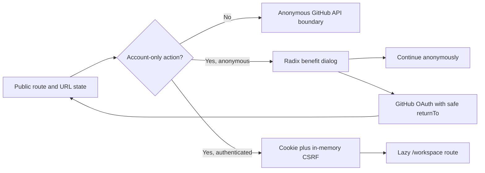
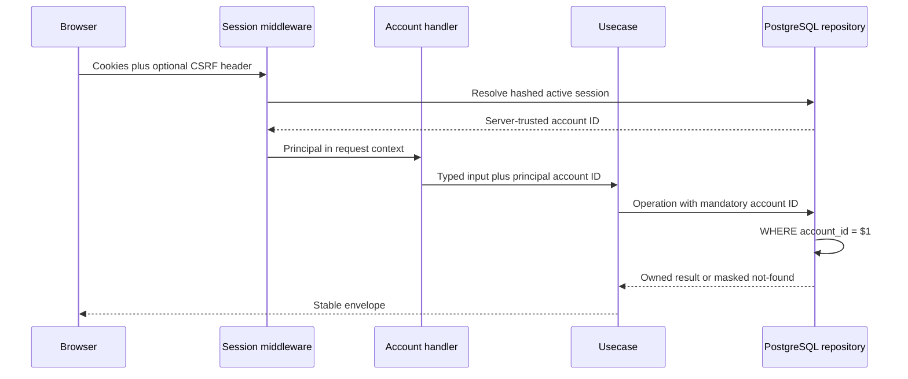

# Authenticated account workspace

IssueScout keeps its public discovery product anonymous and stateless.
GitHub sign-in unlocks only optional, account-owned contribution tasks,
monthly profile snapshots, organized bookmarks, named saved searches with
explicit result-difference checks, display preferences, export, and deletion. Nothing in this feature
changes the anonymous profile, repository, issue-search, or issue-detail
journeys.

## Frontend experience

The header hydrates `GET /api/auth/session` without delaying any public route.
An absent or malformed cookie returns anonymous state without a PostgreSQL
query. A session or database failure changes only the compact account control;
profile analysis, issue search, repository discovery, and issue detail keep
rendering normally.

“Try this issue” actions appear on issue recommendations and issue detail.
They create a private task only and never assign, claim, or comment on GitHub.
Bookmark buttons appear on issue recommendations, issue detail, and repository
cards. `Save this search` stores the current validated issue or repository
filter definition. Anonymous clicks open an explanatory dialog; they never
redirect automatically. Choosing sign-in preserves only a validated
same-origin product path and its current query state. Callback markers are
rendered as accessible success, denial, or failure alerts and then removed from
the URL with history replacement.

Issue-search results can select at most three candidates. Two or three selected
references open a URL-shareable comparison backed by existing bounded detail
evidence. The same selection can be added to Contribution tasks through
idempotent writes.

`/workspace` is a separately loaded route with Contribution tasks, Bookmarks,
Saved searches, Preferences, and Privacy tabs. Queries run only for the active tab. A `401`
clears the in-memory principal and account query cache while preserving local
form state. A `409` asks the user to reload the latest optimistic version, and
a `503` links back to anonymous search. The privacy tab downloads the bounded
JSON export and requires the literal `DELETE` before enabling account
deletion.

Contribution tasks open as a five-column Kanban board with an optional list
view. Pointer users can drag between personal workflow states; the existing
status selector remains the keyboard-accessible equivalent. Moving to
`pr_submitted` or `merged` still requires a saved pull-request reference.

The opaque session remains HttpOnly. The CSRF value exists only in React Query
memory and mutation headers; neither credential enters `localStorage`,
`sessionStorage`, URLs, logs, analytics, source maps, or static artifacts.
Theme and reduced-motion preferences are applied as document data attributes
without browser persistence. The authenticated route is code-split, and the
bundle gate limits every JavaScript asset to 80 KiB gzip.

## Ownership and request boundary

The API never accepts an account ID in a path, query, or body. Every repository
method requires the authenticated `account.ID` and includes it in every read,
update, and delete predicate. A resource owned by another account returns the
same `NOT_FOUND` response as a missing resource. Tests cover these predicates
so an opaque resource UUID cannot become an insecure direct object reference.

Account GET routes require both valid HttpOnly session and CSRF cookies. A
mutation additionally requires the current `X-CSRF-Token` returned by
`GET /api/auth/session`. If authentication is disabled, only account routes
return `AUTH_UNAVAILABLE`; public routes stay usable and database-free.

## Stored data

Contribution tasks store a normalized issue reference, one personal workflow
state (`not_started`, `researching`, `implementing`, `pr_submitted`, or
`merged`), an archive flag, and an optional normalized pull-request reference.
A PR is required for the final two workflow states. Personal workflow never
changes automatically from GitHub state: `observedIssueState` and
`observedPrState` are separate, recoverable observations and default to
`unverified`. Revalidation uses public issue/PR links; the account API performs
no GitHub write.

Bookmarks store the normalized reference plus optional private organization:

- target type (`issue` or `repository`);
- lower-case GitHub repository owner and name;
- a positive issue number when the target is an issue;
- opaque UUID, ownership, timestamps, and optimistic version.
- a note of at most 500 characters;
- one collection label of at most 80 characters;
- at most ten deduplicated tags of 32 characters each.

The stored record returns `upstreamState: unverified`. The workspace can perform
one stateless, on-demand public state observation for a repository, issue, or
pull request. GitHub objects can be renamed,
deleted, made private, or made inaccessible after they are bookmarked.
IssueScout does not run a background copy or persist a GitHub payload. The
frontend can use the anonymous repository or issue endpoint to revalidate a
reference when displaying it, and should offer deletion if it is stale.

Saved searches store a user-visible name, search type, and normalized JSON
filters. Issue filters pass through the same `issue.NewSearchCriteria`
constructor as anonymous issue discovery. Repository filters pass through the
same `repository.NewDiscoveryCriteria` constructor as anonymous repository
discovery. Defaults, trimmed values, supported SPDX identifiers, and bounds
are therefore canonical before storage.

An explicit change check reruns the bounded first 50 results, compares
normalized reference keys with the previous baseline, and displays new and
no-longer-present candidates. Only keys and the check time are stored; there is
no scheduler, notification, or copied GitHub payload.

Preferences store only:

- theme: `light`, `dark`, or `system`;
- reduced motion: `reduce`, `no-preference`, or `system`;
- result page size: `10`, `20`, or `50`.

Before the first preference write, the GET route returns
`system`/`system`/`20` with version zero without inserting a row.

Monthly profile snapshots store one bounded aggregate per UTC calendar month:
language and framework names, public OSS activity counts, observed merged PRs,
proficiency levels, completed quests, and streak lengths. The profile page
upserts the current month only for the authenticated owner and displays at
most 24 months. It stores no repository payload, issue body, credential, or
private GitHub evidence. Public profile sharing remains client-side: Markdown
and PNG downloads are generated from the currently displayed public analysis.

## Bounds and concurrency

| Resource          | Per-account quota | Payload/name bound                   | Stable order                          |
| ----------------- | ----------------: | ------------------------------------ | ------------------------------------- |
| Contribution task |               200 | Issue plus optional PR refs          | `archived, updated_at DESC, id DESC`  |
| Bookmark          |               200 | Reference, note, collection, 10 tags | `created_at DESC, id DESC`            |
| Saved search      |                50 | 80-rune name, 8192-byte JSON         | `updated_at DESC, id DESC`            |
| Preferences       |                 1 | Fixed enums and page sizes           | One row per account                   |
| Profile snapshot  |                24 | Bounded monthly aggregate            | `month ASC`                           |
| List page size    |                50 | Page 1–100                           | UUID is the deterministic tie-breaker |

Contribution-task, bookmark, and saved-search quota checks take a transaction-scoped PostgreSQL
advisory lock keyed by account ID in the same statement as the insert. A
duplicate bookmark write is idempotent and returns the existing row without
incrementing its version. Saved-search names are unique case-insensitively per
account.

Saved-search updates, preference writes, and bookmark/saved-search deletes use
optimistic concurrency. Send the current `version`; a successful update
increments it. `VERSION_CONFLICT` means another request won and the client
must reload before retrying. `ACCOUNT_QUOTA_EXCEEDED` and
`DUPLICATE_SAVED_SEARCH` are separate conflict codes.

## Privacy export and deletion

`GET /api/account/export` returns a schema-versioned bounded document with all
contribution tasks, bookmarks, saved filter definitions, persisted preferences,
and monthly profile snapshots. It excludes:

- GitHub access tokens and GitHub response bodies;
- session, CSRF, and OAuth state hashes;
- privacy-audit identifiers;
- anonymous usernames, searches, analyses, clicks, and history.

`DELETE /api/account` requires CSRF plus the exact JSON confirmation
`{"confirmation":"DELETE"}`. The database deletes the account and cascades to
identities, sessions, contribution tasks, bookmarks, saved searches, preferences,
and profile snapshots. The response
contains only removed row counts. A content-free `account_deleted` audit event
with a null account reference and timestamp remains for privacy-safe
operational evidence. Browser session cookies are expired after deletion.

Export is not a database backup or legal compliance guarantee. Deployment
owners remain responsible for backup retention, data-subject procedures,
audit retention, and jurisdiction-specific policy.

## API inventory

| Method | Path                                                   | CSRF | Purpose                       |
| ------ | ------------------------------------------------------ | ---- | ----------------------------- |
| GET    | `/api/account/issue-claims`                            | No   | List owned contribution tasks |
| PUT    | `/api/account/issue-claims`                            | Yes  | Idempotent task upsert        |
| PATCH  | `/api/account/issue-claims/{issueClaimID}`             | Yes  | Versioned progress update     |
| DELETE | `/api/account/issue-claims/{issueClaimID}`             | Yes  | Versioned task deletion       |
| GET    | `/api/account/bookmarks`                               | No   | List owned bookmarks          |
| PUT    | `/api/account/bookmarks`                               | Yes  | Idempotent bookmark upsert    |
| PATCH  | `/api/account/bookmarks/{bookmarkID}`                  | Yes  | Versioned organization update |
| DELETE | `/api/account/bookmarks/{bookmarkID}`                  | Yes  | Versioned bookmark deletion   |
| GET    | `/api/account/saved-searches`                          | No   | List named filters            |
| POST   | `/api/account/saved-searches`                          | Yes  | Create a named filter         |
| PUT    | `/api/account/saved-searches/{savedSearchID}`          | Yes  | Versioned filter replacement  |
| PATCH  | `/api/account/saved-searches/{savedSearchID}/snapshot` | Yes  | Store explicit-check baseline |
| DELETE | `/api/account/saved-searches/{savedSearchID}`          | Yes  | Versioned filter deletion     |
| GET    | `/api/account/preferences`                             | No   | Read stored/default settings  |
| PUT    | `/api/account/preferences`                             | Yes  | Versioned preference upsert   |
| GET    | `/api/account/profile-snapshots`                       | No   | List monthly growth history   |
| PUT    | `/api/account/profile-snapshots`                       | Yes  | Upsert current UTC month      |
| GET    | `/api/account/export`                                  | No   | Export bounded feature data   |
| DELETE | `/api/account`                                         | Yes  | Permanently delete account    |

Use [`http/account-workspace.http`](../http/account-workspace.http) for every
success and rejection capability. Keep actual cookies and CSRF values in a
private HTTPYAC environment, never in the tracked file.
