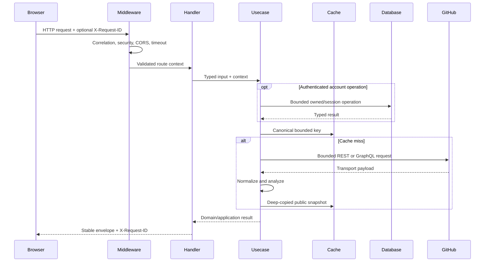

# HTTP API guide

The versioned [OpenAPI 3.1 contract](../packages/contracts/openapi.yaml) is the
source of truth. This guide explains the operational behavior; generated
frontend types must come from the contract.

Browse and execute the same contract through the
[self-contained interactive API reference](api-reference.md), or download it
from a running process at `GET /openapi.yaml`.

## Request flow and trust boundary



Authentication routes use the same middleware envelope and correlation
boundary, but session operations call the separate PostgreSQL adapter. Public
routes never receive that dependency. OAuth start and callback are top-level
browser navigations and return documented `302` responses with a required
`Location` rather than JSON.

## Envelope and headers

Successful responses use:

```json
{
  "data": {},
  "meta": {
    "requestId": "req_example",
    "timestamp": "2026-07-30T00:00:00Z"
  }
}
```

Errors use `error.code`, a safe fixed `error.message`, and the same `meta`.
Every documented response includes `X-Request-ID`; it matches
`meta.requestId`. A valid inbound value of 1–64 ASCII letters, numbers, `_`,
`-`, or `.` is echoed. Invalid or absent values are replaced.

Profile analysis, search, and detail success responses also expose
`X-IssueScout-Cache` as `HIT` or `MISS`.

## Endpoints

| Method and path                                          | Purpose                                                         | Bounds                                                     |
| -------------------------------------------------------- | --------------------------------------------------------------- | ---------------------------------------------------------- |
| GET `/api/health`                                        | Liveness/readiness and request-correlation check                | No upstream or database access                             |
| GET `/api/health/database`                               | Separate authenticated-storage readiness probe                  | One bounded ping; does not gate anonymous routes           |
| GET `/api/github/users/{username}`                       | Normalized public user and repository summaries                 | At most 20 repositories                                    |
| GET `/api/github/users/{username}/profile-analysis`      | Public technology, OSS activity, samples, proficiency, warnings | One GraphQL snapshot; 20 repositories per collection       |
| POST `/api/repositories/search`                          | Filtered public repositories with OSS readiness evidence        | 50 candidates, one 20-repository enrichment batch          |
| POST `/api/issues/search`                                | Eligible, ranked, paginated public issues                       | 50 candidates, 20 detail enrichments, page size at most 50 |
| GET `/api/issues/{owner}/{repository}/{issueNumber}`     | Complete issue recommendation and bounded repository evidence   | One canonical issue; every activity collection is bounded  |
| GET `/api/auth/session`                                  | Optional anonymous/authenticated session bootstrap              | Zero DB calls for absent/malformed cookies                 |
| GET `/api/auth/github/start`                             | Store state, seal PKCE flow, redirect to GitHub                 | One state write; 15-minute maximum                         |
| GET `/api/auth/github/callback`                          | Consume state, fetch public identity, create session            | One-time code; fixed-origin redirect                       |
| POST `/api/auth/session/refresh`                         | CSRF-check and atomically rotate both browser credentials       | One active session transaction                             |
| POST `/api/auth/logout`                                  | CSRF-check, revoke server session, expire cookies               | One session revocation                                     |
| GET `/api/account/bookmarks`                             | List normalized owned GitHub references                         | 200 total; page size at most 50                            |
| PUT `/api/account/bookmarks`                             | CSRF-protected idempotent bookmark upsert                       | Per-account serialized quota                               |
| DELETE `/api/account/bookmarks/{bookmarkID}`             | CSRF/version-protected owned deletion                           | Foreign IDs masked as not found                            |
| GET/POST `/api/account/saved-searches`                   | List/create normalized named filter documents                   | 50 total; filters at most 8192 bytes                       |
| PUT/DELETE `/api/account/saved-searches/{savedSearchID}` | CSRF/version-protected replace/delete                           | Case-insensitive owned names                               |
| GET/PUT `/api/account/preferences`                       | Read defaults or CSRF/version-protected settings                | Fixed enums; one row                                       |
| GET `/api/account/export`                                | Export bounded non-secret account feature data                  | Excludes sessions, audit IDs, and GitHub payloads          |
| DELETE `/api/account`                                    | Confirmed CSRF-protected cascading account deletion             | Content-free audit evidence                                |

Unknown JSON fields, malformed path values, unsupported query keys, control
characters, excessive collection sizes, and out-of-range pagination are
rejected before upstream I/O.

Profile evidence distinguishes `exact`, `sampled`, and `unavailable` values.
Its 365-day contribution window, repository caps, privacy behavior, and
deterministic five-level rules are defined in
[Public profile and OSS analysis](profile-analysis.md).

Repository discovery supports bounded language, technology, SPDX license,
category, popularity, activity, fork, Japanese README, difficulty, and
readiness filters. Its request ceiling, category rules, evidence states, and
partial fallback are defined in
[Repository discovery](repository-discovery.md).

OAuth setup, redirect validation, PKCE, cookie attributes, CSRF, session
rotation, proxy trust, and failure isolation are defined in
[Optional GitHub authentication](authentication.md).

Account ownership, normalized persistence, quotas, optimistic concurrency,
stale upstream references, privacy export, and deletion are defined in
[Authenticated account workspace](account-workspace.md).

## Statuses

Every operation explicitly documents `403`, `500`, and `504` because CORS,
panic recovery, and request deadlines apply at the middleware boundary.
Feature routes additionally declare their possible `400`, `404`, `429`, and
`502` outcomes. The contract forbids a catch-all default response.

| Error code                      | Typical HTTP status | Meaning and caller action                                      |
| ------------------------------- | ------------------: | -------------------------------------------------------------- |
| `INVALID_REQUEST`               |                 400 | Fix request syntax, validation, or bounds                      |
| `INVALID_AUTH_STATE`            |                 400 | Restart login; flow is invalid, expired, mismatched, or used   |
| `GITHUB_AUTHORIZATION_REJECTED` |                 400 | Restart login; GitHub rejected code or public identity         |
| `AUTHENTICATION_REQUIRED`       |                 401 | Bootstrap/login again; session is missing or inactive          |
| `CSRF_REJECTED`                 |                 403 | Bootstrap again and use the current in-memory CSRF token       |
| `GITHUB_USER_NOT_FOUND`         |                 404 | Check the public username                                      |
| `NOT_FOUND`                     |                 404 | Check the route, repository, or issue reference                |
| `GITHUB_RATE_LIMIT_EXCEEDED`    |                 429 | Wait for normalized rate-limit recovery                        |
| `GITHUB_API_ERROR`              |                 502 | GitHub failed or returned unusable required data; retry later  |
| `DATABASE_UNAVAILABLE`          |                 503 | Account storage is unavailable; anonymous routes remain usable |
| `ACCOUNT_QUOTA_EXCEEDED`        |                 409 | Delete an owned item before creating another                   |
| `DUPLICATE_SAVED_SEARCH`        |                 409 | Choose a name not already used by this account                 |
| `VERSION_CONFLICT`              |                 409 | Reload the owned resource and retry with its current version   |
| `AUTH_UNAVAILABLE`              |             502/503 | OAuth/upstream/storage failed; anonymous routes remain usable  |
| `FORBIDDEN_ORIGIN`              |                 403 | Use a browser origin from the exact server allowlist           |
| `INTERNAL_SERVER_ERROR`         |                 500 | Unexpected failure was safely recovered; report request ID     |
| `REQUEST_TIMEOUT`               |                 504 | Caller cancelled or the bounded request deadline elapsed       |

Forbidden-origin responses use an error envelope without exposing allowlist
details. Error messages never include tokens, raw upstream bodies, issue
content, or internal stack traces.

## Search contract

`POST /api/issues/search?page=1&perPage=20` accepts:

- a required validated `username`;
- deduplicated languages, frameworks, and labels;
- star, recency, difficulty, effort, stale inclusion, documentation, English,
  and archived filters;
- only the fields defined in OpenAPI.

Discovery order is stable: build safe GitHub qualifiers, retrieve one bounded
candidate window, apply eligibility, enrich at most 20 candidates, analyze,
rank, filter stale and effort, then paginate. Equivalent condition ordering
shares a five-minute cache. Page, effort, and stale inclusion do not change
the upstream candidate key. Stale exclusion removes only explicit `stale`
assessments; `unknown` evidence stays visible.

## Contract maintenance

1. Edit `packages/contracts/openapi.yaml`.
2. Add or update shared fixtures.
3. Run `pnpm run contracts:sync`.
4. Regenerate frontend types with the web package generator.
5. Run `pnpm run contracts:check`.

The fixture test validates correct documents and proves that undocumented
envelope/payload fields and missing metadata fail. The policy test rejects
undocumented operational statuses, non-envelope JSON, malformed redirect
contracts, missing request IDs, duplicate operation IDs, and default statuses.
A redirect operation must have exactly one explicit success, a required URI
`Location`, and no body. The route check compares Gin registration to every
OpenAPI operation.
