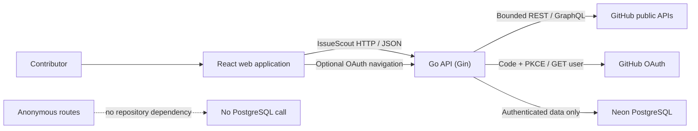
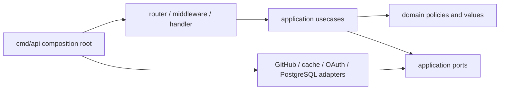
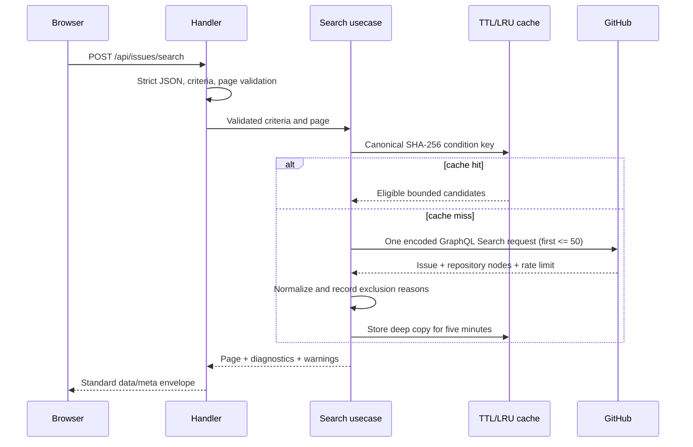
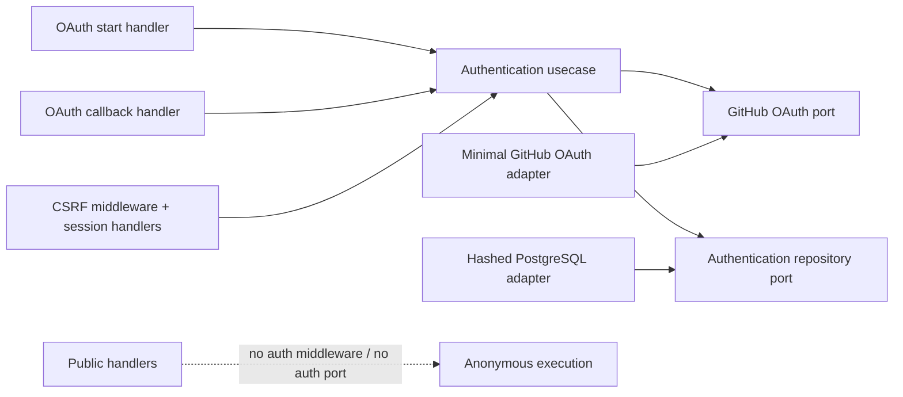

# IssueScout architecture

## Goals

IssueScout has a stateless anonymous recommendation core plus an optional
authenticated account boundary. The browser talks only to the IssueScout API;
the API owns GitHub credentials, upstream rate-limit handling, analysis,
session security, persistence, and response normalization.



The anonymous core does not persist user or issue data. Storage-facing ports
remain behind application boundaries so the authenticated PostgreSQL adapter
cannot leak database access into anonymous handlers.

OAuth is composed only when its complete validated configuration group and
`DATABASE_URL` are present. Authentication start, callback, session, refresh,
and logout depend on dedicated ports and repositories. Public handlers do not.
See [Optional GitHub authentication](authentication.md) and
[Authenticated PostgreSQL persistence](database.md).

## Monorepo boundaries

`apps/web` is an independently buildable React application. It owns browser
routing, accessible presentation, API query hooks, and client-side input
validation. It must not reproduce recommendation rules that belong to the API.

`apps/api` is an independently buildable Go module. Its packages follow this
dependency direction:



Composition happens in `cmd/api` and `internal/router`. Transport packages may
map HTTP values but may not call GitHub directly or calculate scores. Usecases
accept `context.Context`, never Gin context. GitHub transport payloads are
converted to internal models before reaching usecases. Request DTOs, response
DTOs, domain models, and GitHub client models remain distinct even when their
fields initially look similar.

`packages` is reserved for versioned API contracts, generated clients, and
artifacts that have a real cross-application consumer. Shared code is promoted
there only after a second use case exists.

## Performance principles

- Bound every GitHub pagination loop and result set.
- Use cancellation-aware, bounded concurrency for repository inspection.
- Cache only immutable or short-lived upstream reads with explicit limits and
  expiry.
- Deduplicate GitHub requests within one analysis.
- Keep scoring pure and linear in the number of candidate issues.
- Return at most 50 recommendations and render only the initial documented
  result set.
- Track frontend bundle size and split route-level code when feature pages are
  introduced.

Search uses staged enrichment:

```text
GitHub search (up to 50 candidates)
  -> normalize GitHub transport data
  -> cheap eligibility checks and preliminary label difficulty
  -> select the top 20 candidates
  -> bounded repository and issue enrichment (default concurrency: 5)
  -> final scoring and deterministic ranking
```

The pure analysis stage is documented in
[Rule-based issue analysis](issue-analysis.md), including evidence semantics,
quality signals, category priority, technology inference, scope bands,
difficulty, effort, and extension rules.

The implemented discovery stage performs exactly one authenticated GitHub
GraphQL issue-search request with `first <= 50` and never fans out to
repository detail endpoints. The query returns each issue and the repository
fields needed by discovery in one bounded response. It combines typed, safely
quoted GitHub qualifiers for open public issues, no assignee, label OR,
language OR, recency, and archived status. Repository stars, repository
recency, preliminary difficulty, bots, suspicious credential-shaped text,
description sufficiency, and optional framework or language mismatches are
then checked against normalized domain models.



The canonical cache key lowercases, deduplicates, and sorts validated filter
collections. Pagination is intentionally outside that key, so different pages
reuse the same eligible candidate window. The in-memory adapter owns deep
copies, is concurrency-safe, has a fixed capacity, and uses LRU eviction. Equal
concurrent cache misses are coalesced into one upstream request.

Profile analysis uses one GraphQL request rather than per-repository REST
fan-out. It independently caps active owned repositories, active forks, public
contributed repositories, and visible starred repositories at 20; caps owned
language edges at 10; and analyzes at most three language-relevant manifests
from eight conventional object aliases. Private contribution/star nodes are
removed in the adapter. Organizations receive repository evidence while
individual-only activity is explicitly unavailable. The complete selection,
status, proficiency, and OSS rules are documented in
[Public profile and OSS analysis](profile-analysis.md).

Repository discovery independently performs one REST search request for at
most 50 public candidates and one batched GraphQL enrichment request for at
most 20 repositories. It never clones code or fans out one request per
repository. README and contribution-file evidence is normalized before it
reaches the usecase. See
[Repository discovery](repository-discovery.md) for filter, classification,
and confidence rules.

External calls carry the inbound context and use a ten-second client timeout.
Only transient network failures and HTTP 502/503/504 responses are retried, at
most twice, with jittered exponential backoff. Authentication, validation,
not-found, permission, and rate-limit responses are never retried.

GitHub's GraphQL API requires server authentication. `GITHUB_TOKEN` therefore
must be configured for issue discovery even though the IssueScout HTTP route
itself remains anonymous. The token stays inside the API process and is never
part of cache keys, application responses, logs, or browser configuration.

The bounded in-memory caches implement ports so future adapters can replace
them. Initial TTLs are deliberately different by data volatility:

| Data                 |        TTL |
| -------------------- | ---------: |
| Profile analysis     | 30 minutes |
| Repository discovery |  5 minutes |
| Issue search         |  5 minutes |
| Issue ranking        |   1 minute |
| Issue details        |  5 minutes |

Repository discovery uses `REPOSITORY_DISCOVERY_RESULT_LIMIT` (maximum 50),
`REPOSITORY_DISCOVERY_ENRICHMENT_LIMIT` (10 by default, maximum 20),
`REPOSITORY_DISCOVERY_CACHE_TTL` (five minutes by default), and
`REPOSITORY_DISCOVERY_CACHE_CAPACITY` (1000 entries by default).
Issue search uses `ISSUE_SEARCH_RESULT_LIMIT` (maximum 50),
`ISSUE_SEARCH_CACHE_TTL` (five minutes by default), and
`ISSUE_SEARCH_CACHE_CAPACITY` (1000 entries by default). Expensive enriched
rankings use a separate short-lived cache controlled by
`ISSUE_SEARCH_RANKING_CACHE_TTL` (one minute by default) and
`ISSUE_SEARCH_RANKING_CACHE_CAPACITY` (100 entries by default). Invalid or excessive
values fail process startup.

Issue recommendation adds `ISSUE_DETAIL_ANALYSIS_LIMIT` (20 by default),
`ISSUE_DETAIL_CACHE_TTL` (five minutes), and
`ISSUE_DETAIL_CACHE_CAPACITY` (500 entries). The full scoring, sampling,
fallback, and tie-break rules are documented in
[Issue recommendation and detail analysis](./issue-recommendations.md).

Partial enrichment failures return useful successful items plus typed warnings;
a missing user or a failed primary search remains a request-level error.

## API contract principles

- OpenAPI is the source of truth for endpoints, validation, examples, and error
  codes.
- Success responses use a `data` object plus `meta.requestId` and
  `meta.timestamp`.
- Failure responses use an `error` object and the same metadata.
- Paginated responses expose page, per-page, total, total-pages, and has-next.
- GitHub rate-limit information is normalized into optional response metadata.
- The frontend uses generated or contract-checked types rather than maintaining
  a second handwritten schema.
- OAuth navigation success uses an explicit bodyless `302` and required
  `Location`; JSON operations retain the standard envelope.

## Authentication boundaries



The domain owns opaque credential shape, digest comparison, public identity,
return-path, state, session, and principal rules. The usecase owns PKCE
orchestration, single-use state, identity linking, rotation, CSRF decisions,
and safe error mapping. HTTP owns query limits, fixed-origin redirects, Cookie
attributes, and request-context principals. Adapters own GitHub transport,
AES-256-GCM flow sealing, randomness, and parameterized PostgreSQL operations.

## Frontend state principles

- TanStack Query owns server state and request cancellation.
- React Router URL parameters own shareable search state.
- React Hook Form owns form state and schema-backed validation.
- Local component state owns transient UI behavior.
- Empty-before-search, no-results, not-found, rate-limited, upstream-error, and
  partial-analysis states are separate user experiences.
- Components call a shared typed API client; they never call `fetch` directly.

## Security principles

- GitHub tokens are server-only and never appear in API responses, browser
  bundles, logs, fixtures, native binaries, or release archives.
- Upstream responses are normalized; the browser never receives arbitrary
  GitHub transport objects.
- Configuration is read from the environment and examples contain no secrets.
- CORS, timeouts, error mapping, security headers, credentialed-origin policy,
  and explicit trusted proxies are enforced at the API boundary.
- OAuth uses PKCE S256, one-time hashed state, an encrypted HttpOnly flow
  Cookie, a fixed callback, minimum public identity, and immediate upstream
  token disposal.
- Server sessions and CSRF values are random, hashed at rest, rotated
  atomically, bounded per account, and exposed only through purpose-specific
  Cookie/header boundaries.
- Search values reject quotes, backslashes, control characters, unknown JSON
  fields, and oversized request bodies before any GitHub request.
- Issue candidates containing credential-shaped text are excluded from
  recommendations and counted using a non-content exclusion code.
- Untrusted issue content is rendered without raw HTML execution.

## Quality principles

- Strict TypeScript and idiomatic, formatted Go are mandatory.
- Each feature includes focused tests plus systemic contract, HTTPYAC, and E2E
  coverage.
- Root commands are the local source of truth for CI.
- Refactoring follows passing characterization tests and preserves layer
  boundaries.
- Each pull request receives an explicit self-review for architecture,
  correctness, performance, security, test quality, accessibility, and
  operational impact before it is marked ready.

The final bound, latency, privacy, frontend, security, and delivery audit is in
[Production readiness](production-readiness.md).
