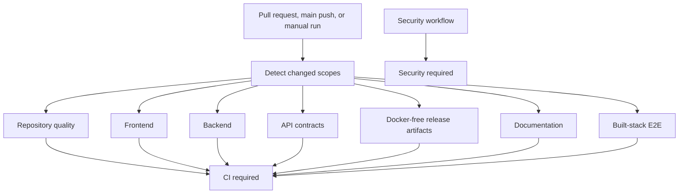

# Continuous integration

IssueScout treats CI as an executable engineering policy. Pull requests do not receive repository or deployment write permissions, actions are pinned to immutable commit SHAs, superseded runs are cancelled, and every job has a bounded timeout.

## Pipeline



Change detection avoids unrelated expensive work, but `CI required` always runs. It accepts an individual job only when that job succeeds or was legitimately skipped. A failure or cancellation fails the aggregate status, so branch protection needs one stable required check instead of a changing list of path-aware checks.

## Enforced gates

| Job                | Enforcement                                                                                                   |
| ------------------ | ------------------------------------------------------------------------------------------------------------- |
| Repository quality | Formatting, architecture, migration and Docker-free policies, Actions/Shell/Markdown lint, commit/PR metadata |
| Frontend           | Type-aware ESLint, strict TypeScript, Vitest coverage, production build, gzip bundle budget                   |
| Backend            | GoDoc AST policy, golangci-lint, race/Example tests, coverage, fuzzing, performance budgets, production build |
| API contracts      | Redocly, status/envelope/header policy, fixtures, generated types, route drift, complete executable HTTPYAC   |
| Release artifacts  | Two independent builds, byte comparison, secret-surface scan, checksums, manifests, native lifecycle smoke    |
| Documentation      | markdownlint, links, Mermaid parsing, and complete command/configuration/API coverage                         |
| End-to-end         | Native process lifecycle/smoke plus production Vite and compiled Go API in Chromium                           |

The workflow does not use pull request secrets. Failure evidence is retained for seven days; the validated OpenAPI contract is retained for 14 days. E2E evidence includes the HTML report, trace, screenshot, and video when Playwright produces them.

## Local reproduction

Install the locked workspace dependencies first:

```sh
pnpm install --frozen-lockfile
```

The normal gate is:

```sh
pnpm run check
```

Run the stricter CI gates with:

```sh
pnpm run coverage:api
pnpm run fuzz:api
pnpm run performance:api
pnpm run docs:go:check
pnpm run coverage:web
pnpm run bundle:check
pnpm run contracts:check
pnpm run http:check
pnpm run migrations:check
pnpm run lint:docs
pnpm run lint:workflows
pnpm run e2e
pnpm run release:reproducibility v0.0.0-local
```

`golangci-lint`, `actionlint`, and `shellcheck` are expected developer tools. CI installs or provisions fixed versions. The actionlint release archive is checked against its pinned upstream SHA-256 before installation. The workflow pins third-party actions by commit SHA; Dependabot proposes controlled SHA updates.

The release job builds the same revision twice in independent temporary
directories and compares all six archives plus `SHA256SUMS`. It expands every
archive to reject environment files, source maps, key material, and
credential-shaped content before running the packaged API/web readiness,
request ID, and graceful shutdown smoke test.

## Budgets

`config/quality-budgets.json` is the single budget source:

- API statement coverage: at least 82%;
- web statements, branches, functions, and lines: at least 70%;
- bounded analysis: at most 5 ms, 256 KiB, and 200 allocations per operation;
- recommendation scoring: at most 1 ms, 128 KiB, and 1,000 allocations per operation;
- largest JavaScript asset: no more than 75 KiB gzip;
- all JavaScript and CSS assets: no more than 209 KiB gzip.

The 209 KiB aggregate allowance includes the independently loaded account
workspace, contribution task board, contribution calendar, portfolio, and OSS
Journey, while the 75 KiB per-asset ceiling keeps shared and anonymous route
chunks tightly bounded. Raise coverage expectations as features gain tests.
Any budget change requires measured justification in the pull request and must
not conceal a regression.

The API-contract job also executes all tracked HTTPYAC requests against an
ephemeral loopback server. It checks complete operation coverage, negative
boundaries, anonymous credential isolation, inert environments, and real
HTTPYAC syntax without contacting GitHub, OAuth, PostgreSQL, or a developer
process.

## Pull request policy

A ready pull request must contain:

- a GitHub closing keyword such as `Closes #13`;
- `Summary`, `Related issue`, `Validation`, `Performance impact`, `Security impact`, and `Self-review` sections;
- no incomplete checkboxes;
- at least one non-merge Conventional Commit.

Draft pull requests may retain incomplete self-review boxes. The metadata gate reruns when a pull request is edited or marked ready.

## Recommended main protection

Configure the `main` branch with:

1. Require a pull request before merging.
2. Require `CI required` and `Security required`, and require branches to be up to date.
3. Require conversation resolution.
4. Apply protection to administrators.
5. Block force pushes and branch deletion.
6. Require one approval in a multi-maintainer team. A single-maintainer repository may use zero required approvals while retaining the automated gate and explicit self-review.
7. Do not require linear history while merge commits are the documented strategy.

Repository Actions permissions should default to read-only. Allow GitHub Actions to create pull requests only for an explicitly reviewed automation use case. Release write permissions belong in a dedicated workflow with a protected environment, not in pull request CI. IssueScout intentionally uses Docker-free release archives.

## Updating actions

Never replace a full action SHA with a mutable tag. Verify the upstream release and compare the action source before accepting a Dependabot SHA update. Run `pnpm run lint:workflows` locally; the policy checker rejects mutable action references, write-level top permissions, `pull_request_target`, inherited secrets, missing concurrency, and jobs without timeouts.
