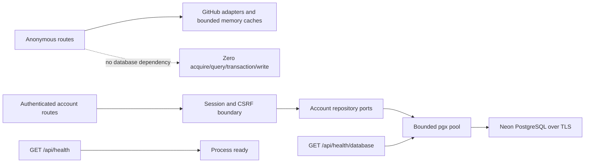

# Authenticated PostgreSQL persistence

IssueScout uses Neon PostgreSQL only for optional authenticated account
capabilities. Public profile analysis, repository discovery, issue discovery,
issue detail, and process health are structurally database-free. A missing,
exhausted, or unreachable pool must not disable those anonymous journeys.

## Runtime boundary



The composition root creates no pool when `DATABASE_URL` is empty. When it is
set, pool construction is lazy and does not ping PostgreSQL during process
startup. Account operations fail closed if PostgreSQL is unavailable, while
anonymous handlers remain composed without database repositories.

## Secret and TLS policy

Store a rotated connection URL only in the ignored `apps/api/.env` file or an
approved deployment secret manager:

```dotenv
DATABASE_URL=postgresql://<role>:<rotated-password>@<host>/<database>?sslmode=require
```

The URL must contain a PostgreSQL scheme, role, password, host, database name,
and exactly one `sslmode=require` or `sslmode=verify-full`. IssueScout rejects
plaintext database connections. The `config.Secret` wrapper formats configured
values only as `<redacted>`; adapter, migration, health, and repository errors
also discard driver details.

Any database credential pasted into chat, an issue, a terminal transcript, or
another non-secret channel is compromised and must be rotated before use. Do
not copy the previously shared connection string into this repository or a
deployment.

## Pool policy

| Setting                             | Default | Bound or behavior                          |
| ----------------------------------- | ------- | ------------------------------------------ |
| `DATABASE_MAX_CONNECTIONS`          | `10`    | 1–100; hard pool ceiling                   |
| `DATABASE_MIN_CONNECTIONS`          | `0`     | 0–maximum; avoids eager anonymous startup  |
| `DATABASE_CONNECT_TIMEOUT`          | `5s`    | Positive, at most one minute               |
| `DATABASE_QUERY_TIMEOUT`            | `5s`    | Query, statement, and idle-transaction cap |
| `DATABASE_MAX_CONNECTION_LIFETIME`  | `30m`   | Positive, at most 24 hours                 |
| `DATABASE_MAX_CONNECTION_IDLE_TIME` | `5m`    | Positive, at most 24 hours                 |
| `DATABASE_HEALTH_CHECK_PERIOD`      | `30s`   | Positive, at most one hour                 |

The adapter also sets a two-second-or-shorter lock timeout and a fixed
`application_name`. Every repository operation derives a deadline from the
caller context, uses positional parameters, and maps driver errors to safe
sentinels.

## Schema and deletion semantics

Forward migration `000001` creates accounts, one GitHub identity per account,
single-use OAuth state hashes, and hashed session/CSRF material. Forward
migration `000002` creates normalized bookmarks, validated JSON saved filters,
preferences, and content-free privacy audit events. Forward migration `000003`
creates normalized account-owned issue claims with personal workflow state,
optional pull-request references, separate upstream observations, and
optimistic versions.

The database never stores:

- GitHub access tokens;
- anonymous usernames, searches, clicks, or analyses;
- raw GitHub responses or README text;
- plaintext session, CSRF, or OAuth state values;
- a database URL or database credential.

Identity, session, issue-claim, bookmark, saved-search, and preference rows reference an
account with `ON DELETE CASCADE`. Deleting an account therefore removes every
account-owned row. The account repository performs deletion and a content-free
`account_deleted` audit insert in one PostgreSQL statement. Privacy audit rows
retain only an event type and timestamp; the deletion event has a null account
reference.

Repository methods accept a validated opaque account UUID and include it as a
parameterized ownership predicate. A missing or foreign account is exposed as
not found, preventing identifier enumeration.

Issue-claim, bookmark, and saved-search quota checks serialize per account with
transaction-scoped advisory locks in the insert statement. Bookmark duplicate
writes are idempotent, as are duplicate issue-claim upserts. Issue-claim and
saved-search updates and all feature deletes include the current optimistic version. Full behavior and privacy export policy are in
[Authenticated account workspace](account-workspace.md).

GitHub identity linking takes a transaction-scoped advisory lock keyed by the
numeric GitHub user ID. Two concurrent first callbacks therefore serialize,
reuse the unique identity, and cannot create duplicate accounts. State
consumption is one atomic conditional update. Session rotation revokes the old
token and inserts the new session/CSRF hashes in one transaction.

## Native migration workflow

No Docker or container runtime is required. After placing only a rotated
credential in `apps/api/.env`, inspect and apply the catalog from the
repository root:

```sh
pnpm run database:status
pnpm run database:migrate
pnpm run database:verify
```

`status` shows version, name, applied/pending state, and the non-sensitive
SHA-256. `migrate` takes a PostgreSQL advisory lock, verifies every historical
checksum, and applies each pending file in its own transaction. `verify`
fails when any migration is pending, unknown, missing from the applied prefix,
or checksum-mismatched.

Migration files are forward-only, contiguous, and append-only after merge.
`pnpm run migrations:check` rejects edits/deletions/renames of historical
files, destructive statements, privileged extension installation, explicit
transaction statements, database URLs, oversized files, and account-owned
tables without cascade semantics.

## Clean-database verification

For an approved disposable PostgreSQL database, set a separate rotated
`TEST_DATABASE_URL` in the shell and run:

```sh
go -C apps/api test -run TestMigrationsAgainstConfiguredPostgreSQL \
  ./internal/database/postgres

go -C apps/api test -run TestAuthRepositoryAgainstConfiguredPostgreSQL \
  ./internal/database/postgres

go -C apps/api test -run TestAccountFeaturesAgainstConfiguredPostgreSQL \
  ./internal/database/postgres
```

The test creates a randomly named isolated schema, migrates it twice to prove
idempotency, verifies checksums and required tables, then removes only that
schema. The authentication test independently verifies single-use state,
identity linking, session lookup, rotation, full revocation, and the absence of
plaintext browser credentials. The variable is intentionally absent from
ordinary tests and pull request CI because untrusted PR code must never receive
a database secret.

## Least-privilege deployment

Use separate migration and runtime roles. The migration role owns the
IssueScout schema and runs only the reviewed migration command. The runtime
role receives connect/schema usage plus `SELECT`, `INSERT`, `UPDATE`, and
`DELETE` on IssueScout tables; it must not create schemas/extensions, alter
roles, bypass row ownership, or own the database. Revoke default public schema
creation where the hosting account permits it.

Record the environment, migration versions, checksums, operator, and time as
deployment evidence. Never record the connection URL. Backups, point-in-time
recovery, branch retention, and credential rotation remain infrastructure
controls and should be tested before enabling account data in production.
