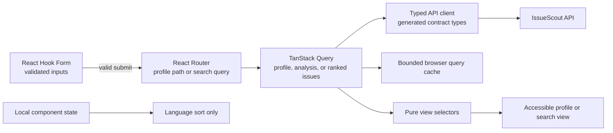
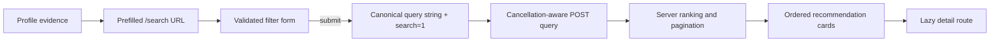

# Frontend architecture

IssueScout's web application is a strict TypeScript React application. It keeps
the anonymous profile journey shareable, cancellation-aware, accessible, and
independent of future authenticated database features.

## Route and state ownership



The ownership rules are deliberate:

- React Hook Form owns input value, validation messages, and submission state.
- React Router owns profile usernames plus validated search filters and
  pagination because both journeys must be linkable.
- TanStack Query owns remote data, cache lifetime, retry policy, and request
  cancellation.
- Component state owns only transient presentation such as language ordering.
- The Go API owns analysis and recommendation rules. React components format
  evidence but do not recreate domain scoring.

No global client-state store is needed for the anonymous flow.

## Interface localization

The web client ships a typed English and Japanese message catalog. English is
the default; the language switcher in both desktop and mobile navigation saves
the selected locale under `issuescout.locale` in local storage and updates the
document `lang` attribute. If storage is blocked or contains an unsupported
value, the client safely falls back to English.

Localization applies only to IssueScout-owned interface copy, accessible
labels, dates, and compact number formatting. GitHub-owned content—including
usernames, repository names, issue titles and bodies, labels, topics, and
technology names—is rendered unchanged. Adding a new English message requires
the Japanese catalog to provide the same typed key, so TypeScript catches
catalog drift during CI.

The Japanese catalog is emitted as an on-demand `locale-ja` chunk. CI enforces
the reviewed core bundle limits and a separate 20 KiB gzip ceiling for all
optional locale chunks, preventing localization from silently inflating the
default English download or growing without review.

## API boundary

`packages/contracts/openapi.yaml` is the contract source. The
`contracts:generate` command produces TypeScript models in
`apps/web/src/shared/api/generated`; `contracts:check` fails when committed
output drifts from OpenAPI.

Components never call `fetch` directly. Profile hooks call the shared client,
which:

- accepts TanStack Query's `AbortSignal`;
- validates JSON content types and the shared success/error envelope;
- converts failures to a typed `ApiError`;
- uses the configured, credential-free `VITE_API_BASE_URL`;
- retries at most one transient failure and never retries validation,
  forbidden, not-found, or rate-limit responses.

The profile and analysis requests run concurrently. Ranked issue search uses an
idempotent typed POST behind a TanStack Query abstraction. Navigating away
aborts obsolete profile and search requests, so stale work cannot update the
route.

## Component system

Repository-owned components in `apps/web/src/components/ui` follow shadcn
composition conventions and wrap Radix primitives where interaction behavior
matters. Class Variance Authority defines button and badge variants,
`tailwind-merge` resolves utility overrides, and Lucide supplies icons that are
decorative by default unless an accessible label is explicitly required.

The shared primitives include:

- buttons, inputs, labels, fields, cards, badges, alerts, and skeletons;
- keyboard-accessible Dialog, Popover, Select, Tooltip, multi-select,
  Checkbox, Slider, and server-driven pagination components;
- a semantic icon adapter and `cn` class utility;
- a responsive application shell with skip navigation, visible focus rings,
  mobile navigation, and light/dark themes.

Colors, radii, surfaces, focus rings, score tones, and status tones come from
semantic CSS tokens in `apps/web/src/styles.css`. Feature components use those
tokens instead of embedding one-off color values.

## Profile journey states

| State                 | User experience                                                          |
| --------------------- | ------------------------------------------------------------------------ |
| Initial               | Username form; no network request                                        |
| Invalid input         | Inline accessible error; route and API remain unchanged                  |
| Loading               | Named status region and layout-preserving skeletons                      |
| Success               | Identity, metrics, technologies, languages, frameworks, and repositories |
| Empty evidence        | Explicit neutral messages for missing languages/frameworks/repositories  |
| Not found             | Profile-specific recovery with a link back to the form                   |
| Rate limited          | GitHub-specific explanation without an automatic retry storm             |
| Retryable upstream    | Manual retry with pending feedback and request reference when available  |
| Invalid/catch-all URL | Safe error or not-found page; no malformed API request                   |

Partial analysis warnings remain visible alongside successful evidence rather
than replacing the entire result with an error.

## Ranked issue search

The `/search` page uses the URL as the only durable client-side search state.
Repeated `language`, `framework`, and `label` parameters preserve typed
multi-select values; scalar criteria and `page`/`perPage` are validated before
the query hook is enabled. `search=1` is the explicit execution marker. A
prefilled profile link intentionally omits it so users can review the detected
technologies before consuming GitHub API capacity.



The UI never sorts recommendation items. It uses the API's order and
`pagination` object as the source of truth. Presentation-only mappings for
score tones, skill status, and warning severity live in one model rather than
being repeated across cards.

| Search state     | User experience                                            |
| ---------------- | ---------------------------------------------------------- |
| Before search    | Editable prefilled/default criteria; zero search requests  |
| Invalid URL      | Focused correction guidance; query remains disabled        |
| Loading          | Named skeleton status without stale layout collapse        |
| Success          | Ordered explainable cards and server pagination            |
| No results       | Concrete suggestions for broadening filters                |
| Partial evidence | Successful cards plus an explicit bounded-evidence warning |
| User not found   | Username-specific correction without automatic retries     |
| Rate limited     | Stable URL and reset guidance without retry storms         |
| Upstream/timeout | Request ID and a manual retry action                       |
| Page transition  | Prior page remains visible while the next page is fetched  |

## Accessibility verification

Semantic headings, lists, links, progress bars, form descriptions, and status
regions are covered by Testing Library queries that reflect assistive
technology output. Dedicated interaction tests verify:

- dialog focus containment, Escape dismissal, and trigger focus restoration;
- keyboard opening and dismissal of popovers;
- arrow-key selection in Radix Select;
- tooltip content exposed on focus;
- skip navigation and mobile navigation in production Chromium.
- mobile search Popover filtering, Escape dismissal, and trigger focus
  restoration;
- search submission request shape plus back/forward restoration of server
  pagination.
- repository filter validation, URL restoration, cancellation, partial
  evidence, and server-order preservation;
- profile evidence states that distinguish exact, sampled, and unavailable
  observations.
- private monthly snapshot deltas for the authenticated profile owner and
  client-side Markdown/PNG public-profile exports.

Reduced-motion preferences disable nonessential animation.

## Performance budget

Route components are loaded with `React.lazy`. The profile dashboard and form
dependencies are split from the application shell so visitors do not download
every feature before choosing a profile. The repository filter codec is shared
by the profile handoff and repository route as a separate lazy chunk.

Vite keeps the route chunks independent while grouping the always-shared UI,
query, and search-presentation modules into `app-shared`. React Hook Form and
the profile form that always consumes it share a lazy `form-runtime` chunk.
This keeps initial-route boundaries intact and avoids paying separate gzip
dictionary overhead for modules that are fetched together.

Measured gzip sizes on 2026-07-30:

| Checkpoint                                      | Total JS + CSS | Largest JS |
| ----------------------------------------------- | -------------: | ---------: |
| UI system before landing/profile feature routes |     123.83 KiB | within cap |
| Landing and complete profile journey            |     160.84 KiB | 117.62 KiB |
| Profile plus ranked issue search journey        |     175.35 KiB | 118.32 KiB |
| Search plus complete issue recommendation       |     179.49 KiB |  68.80 KiB |
| Extended profile plus repository discovery      |     192.48 KiB |  69.65 KiB |
| English core with localization (2026-08-16)     |     216.70 KiB |  76.11 KiB |
| Optional Japanese locale chunk                  |      12.73 KiB |  12.73 KiB |
| Enforced core maximum                           |     217.00 KiB |  80.00 KiB |

Run `pnpm run build:web && pnpm run bundle:check` after frontend dependency or
route changes. The CI budget reads `config/quality-budgets.json`; changing the
budget is a reviewed engineering decision, not a workaround for a regression.

## Local verification

```sh
pnpm --filter @issuescout/web lint
pnpm --filter @issuescout/web typecheck
pnpm --filter @issuescout/web test:coverage
pnpm run build:web
pnpm run bundle:check
pnpm run e2e
```

The E2E journey uses the production Vite build and compiled Go API with
`APP_ENV=test` and the deterministic GitHub port adapter. The primary
profile → search → detail journey therefore crosses the real browser, HTTP,
handler, usecase, cache, and response-mapping boundaries without live GitHub
traffic. Focused browser-boundary tests still intercept selected requests with
the shared contract fixtures when they need exact pagination or unsafe-content
payloads.
