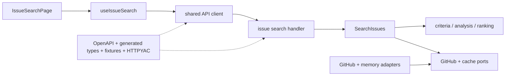

# Handover walkthrough

This walkthrough lets an engineer with no prior IssueScout context prove the
product, understand its boundaries, make a safe change, and prepare a release.

## First 60 minutes

|      Time | Action                                                                                                               | Expected evidence                                                              |
| --------: | -------------------------------------------------------------------------------------------------------------------- | ------------------------------------------------------------------------------ |
|  0–10 min | Read [Product](product.md), [MVP compliance](mvp-compliance.md), and [Architecture](architecture.md)                 | Understand anonymous core, optional account boundary, and dependency direction |
| 10–20 min | Install the pinned workspace and run `make dev-smoke`                                                                | Native API/web start, request correlation, mock profile, graceful stop         |
| 20–30 min | Open OpenAPI/Swagger and read [HTTPYAC](httpyac.md)                                                                  | Locate every contracted operation and safe manual probes                       |
| 30–40 min | Run `pnpm run test`, `pnpm run contracts:check`, and `pnpm run lint:docs`                                            | Unit, contract, HTTPYAC, links, commands, Mermaid pass                         |
| 40–50 min | Trace one feature from React route to handler/usecase/domain/adapter                                                 | Explain where validation, I/O, and scoring belong                              |
| 50–60 min | Read [Production readiness](production-readiness.md), [Operations](operations.md), and [Limitations](limitations.md) | Know performance conditions, incident path, and non-goals                      |

## Clean checkout proof

```sh
git clone https://github.com/tensho1026/github-issue-search.git
cd github-issue-search
corepack enable
corepack prepare --activate
pnpm install --frozen-lockfile
make dev-smoke
```

No `.env`, GitHub token, OAuth App, PostgreSQL, or Docker installation is
required. If this sequence fails, stop and fix the setup or documentation
before beginning feature work.

For interactive local development:

```sh
cp apps/api/.env.example apps/api/.env
cp apps/web/.env.example apps/web/.env
make dev
```

Keep secrets only in the ignored API file. The web `.env` may contain only
browser-safe configuration.

## Trace a feature

Use issue search as the reference path:



When reviewing a change, ask:

1. Is transport validation in the handler or a shared transport helper?
2. Is business logic pure and independent of Gin/GitHub/PostgreSQL?
3. Does the usecase accept and propagate `context.Context`?
4. Is every collection, body, timeout, retry, cache, and goroutine bounded?
5. Is GitHub transport normalized before the application/domain boundary?
6. Does the React feature use URL/query/form/local state in the intended owner?
7. Did OpenAPI, fixtures, generated types, HTTPYAC, and docs change together?

## Change workflow

1. Open an English issue with `Summary`, `Scope`, requirements, acceptance
   criteria, and test plan.
2. Update local `main`.
3. Create `codex/issue-<number>-<short-name>` for Codex work or
   `feature/issue-<number>-<short-name>` for human work.
4. Add a failing narrow test or characterization where appropriate.
5. Implement the smallest layer-correct change.
6. Commit small Conventional Commit units.
7. Run affected checks, then the strict gate and E2E.
8. Open a PR containing `Closes #<number>` and every template section.
9. Self-review architecture, correctness, performance, security, tests,
   accessibility, operations, and docs.
10. Merge only after `CI required` and `Security required` are green and every
    actionable conversation is resolved.

## Validation ladder

```sh
# Fast, affected scope
pnpm run format:check
pnpm run test:api
pnpm run test:web

# Contracts and documentation
pnpm run contracts:check
pnpm run lint:docs
pnpm run lint:workflows

# Full pre-PR evidence
pnpm run quality:strict
pnpm run e2e

# Delivery changes or release candidates
pnpm run release:reproducibility v0.0.0-handover
```

Run `pnpm run database:verify` only when optional persistence is configured.
Pull-request CI intentionally has no database or OAuth secret.

## Ownership map

| Change                | Start here                                  | Mandatory companion                               |
| --------------------- | ------------------------------------------- | ------------------------------------------------- |
| Product rule or score | `apps/api/internal/domain`                  | Rule tests and issue-analysis/recommendation docs |
| Upstream GitHub field | `apps/api/internal/client/github`           | Port/domain mapping, bounds, adapter tests        |
| HTTP request/response | `packages/contracts/openapi.yaml`           | Handler, fixtures, generated types, HTTPYAC       |
| Orchestration/cache   | `apps/api/internal/usecase` and ports       | Cancellation, concurrency, copy, load tests       |
| Browser journey       | `apps/web/src/features` and route page      | Hook/component/E2E/accessibility evidence         |
| Account persistence   | Domain/usecase port then PostgreSQL adapter | Migration, ownership, quota, export/deletion      |
| CI/security           | Reusable script then workflow               | Workflow lint/policy and CI guide                 |
| Release/deploy        | Release scripts/workflows                   | Reproducibility, scans, operations/delivery docs  |

## Release handoff

Before transferring a release to operations, provide:

- commit and annotated tag;
- successful CI/Security run URLs;
- archive checksum and attestation verification;
- release dry-run evidence;
- migration status and any account-feature rollout decision;
- target health origin;
- previous healthy release for rollback;
- current limitations and any time-bounded security exception;
- safe request IDs from post-promotion smoke.

The receiving engineer should independently verify checksums, process health,
the anonymous profile/search/detail journey, and database readiness only when
account features are enabled.

## Definition of understood

An engineer is ready to own IssueScout when they can:

- explain why public routes do not need OAuth or PostgreSQL;
- point to the exact 50/20/5 bounds and cancellation behavior;
- follow one field from OpenAPI through generated frontend and Go response;
- explain score evidence and unknown/partial semantics;
- diagnose a request using only privacy-safe fields;
- reproduce strict quality and a native release;
- roll back to an existing attested archive without rebuilding it.
