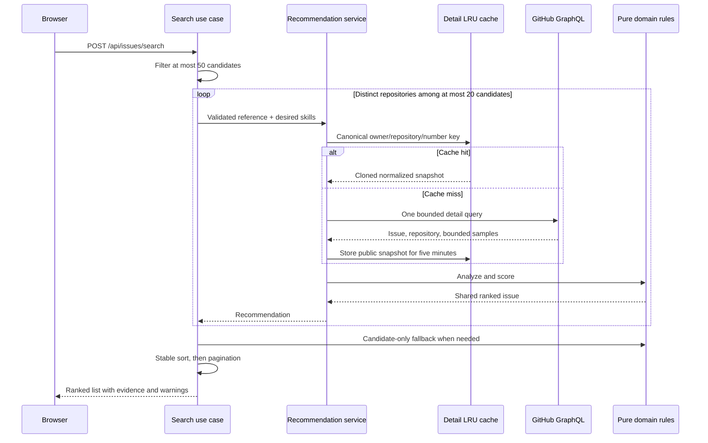

# Issue recommendation and detail analysis

IssueScout ranks eligible public GitHub issues with a deterministic,
explainable 100-point model. The same application service and cached public
snapshot back both the search list and issue-detail endpoint, so list and
detail views never silently use different rules.

## Request flow



The search flow considers at most `ISSUE_DETAIL_ANALYSIS_LIMIT` candidates from
the at-most-50 discovery window. Within that window it selects one detail
leader per repository and reuses the normalized repository/maintainer snapshot
for sibling issues. `GITHUB_API_MAX_CONCURRENCY` bounds distinct-repository
fan-out, and cancellation propagates through the group. A sibling's comment
window is not inferred from the leader: its claim evidence stays unavailable.

## Score model

Every component has a fixed maximum. The component maximums sum to exactly
100, and each response exposes both score and maximum.

| Component                 | Maximum | Inputs                                                |
| ------------------------- | ------: | ----------------------------------------------------- |
| Skill match               |      30 | Explicit matched/denominator percentage               |
| Issue quality             |      20 | Nine issue-description signals                        |
| Repository quality        |      15 | README, CONTRIBUTING, CI, tests, Code of Conduct      |
| Activity                  |      15 | Last update, sampled PR merge ratio, CI, contributors |
| Maintainer responsiveness |      10 | Sampled issue response, PR review, PR merge durations |
| Availability              |      10 | Assignees, explicit claims, issue activity            |

Unknown evidence earns no points but is not converted to observed absence.
Clients can distinguish signal states (`present`, `absent`, `not_applicable`,
`unknown`), aggregate states (`available`, `unavailable`), and match states
(`matched`, `unmatched`, `unknown`).

### Skill denominator

A required technology enters the denominator only when its confidence is
medium or high and the caller supplied at least one desired skill.
Low-confidence requirements remain `unknown`. The percentage is
`round(matched / denominator * 100)`. A zero denominator produces a zero
percentage plus unknown entries, not a claim that the user has no skills.

Search uses `languages` and `frameworks` as desired skills. Detail accepts
repeatable values:

```text
GET /api/issues/openai/openai-go/42?skills=Go&skills=PostgreSQL
```

The handler accepts at most 20 values of 64 bytes, rejects control characters
and unsupported keys, and deduplicates case-insensitively.

## Repository readiness

The bounded detail query checks:

- common README names in the root, `.github`, and `docs`;
- common CONTRIBUTING names in the root, `.github`, and `docs`;
- `.github/workflows`;
- `tests`, `test`, and `spec`;
- the bounded root `package.json` test scripts;
- dependency identifiers from bounded root `package.json` and `go.mod` blobs;
- `CODE_OF_CONDUCT.md` in the root, `.github`, and `docs`.

Each result is independent. A package manifest is proof only when it defines a
non-empty `test` or `test:*` script. Because ecosystems such as Go colocate
tests with source files, missing test directories and scripts remain `unknown`
rather than becoming a false `absent`. For a partial GraphQL response, observed
objects remain `present`, while omitted objects become `unknown`.

Manifest dependency names are normalized, deduplicated, sorted, and capped at
100 before rule evaluation. They provide high-confidence technology evidence;
versions, scripts, arbitrary manifest content, and source code are never
included in response evidence.

## Activity and maintainer samples

| Collection                 | Bound |                    Window |
| -------------------------- | ----: | ------------------------: |
| Default-branch commits     |    50 |                  180 days |
| Repository issues          |    50 |                  180 days |
| Comments per sampled issue |    10 | First response candidates |
| Pull requests              |    50 |                  180 days |
| Reviews per sampled PR     |    10 | First response candidates |
| Target issue comments      |    50 |           Claim detection |

Every count, ratio, and duration exposes `status`, `sampleSize`, `windowDays`,
`truncated`, and `confidence`. Values and duration seconds are JSON `null` when
unavailable; they are never misleading zeroes.

- Contributor count is distinct non-bot users in the bounded default-branch
  commit sample, not a lifetime total.
- PR count excludes drafts. Merge ratio is merged PRs divided by sampled
  non-draft PRs opened in the window; an empty denominator is unavailable.
- Issue response is the first non-bot `OWNER`, `MEMBER`, or `COLLABORATOR`
  comment after creation.
- PR review is the first non-bot maintainer review and excludes drafts.
- PR merge duration uses completed, non-draft PRs.
- Duration summaries use the median and nearest-rank 90th percentile.
  Non-positive and over-180-day outliers are excluded.

### Maintainer Response Score

The dedicated Maintainer Response Score is a one-to-five assessment derived
from the bounded, maintainer-only first issue response and first pull request
review samples above. Each sample contributes in proportion to its size:

| Median response time | Base level |
| -------------------- | ---------: |
| Up to 24 hours       |          5 |
| Up to 3 days         |          4 |
| Up to 7 days         |          3 |
| Up to 14 days        |          2 |
| More than 14 days    |          1 |

Response coverage is `(sampled issues - unanswered sampled issues) / sampled
issues`. Coverage below 75%, 50%, or 25% caps the level at 3, 2, or 1
respectively, so quick replies to a small subset cannot hide unanswered work.
The response includes the level, label, confidence, sample size, window,
coverage, and component duration aggregates. PR merge time is displayed as
context but does not imply that every acceptable contribution will be merged.

This is historical, bounded evidence. It does not guarantee that a maintainer
will respond to or merge a future contribution.

## Conservative risks

Warnings contain a stable code, severity, fixed message, and normalized
evidence. Arbitrary issue/comment text is never copied into evidence.

| Warning                         | Trigger                                           |
| ------------------------------- | ------------------------------------------------- |
| `likely_claimed`                | Explicit human work/assignment statement          |
| `stale_repository`              | No meaningful update within 180 days              |
| `failing_ci`                    | Default-branch check rollup fails                 |
| `slow_issue_response`           | Median maintainer response exceeds 14 days        |
| `abandoned_pull_request_risk`   | Open PR older than 60 days and inactive for 30    |
| `unanswered_issue_risk`         | Issue older than 14 days has no sampled response  |
| `repository_signal_unavailable` | Conventional-path inspection is incomplete        |
| `detail_enrichment_unavailable` | Search used candidate-only fallback               |
| `claim_evidence_unavailable`    | Repository evidence reused without issue comments |

“Can I work on this?” is intentionally not a claim. Bots are excluded. A
truncated comment window with no claim produces low-confidence negative
evidence.

## Stable ranking

Tie-breakers are score, skill percentage, stars, issue update time, repository
full name, and issue number. The first four are descending; names and numbers
are ascending. Sorting uses a copy and does not mutate domain or cache input.

## Available-time filtering

Search accepts an optional `maximumEffort` value from the same ordered bands
returned by analysis: `thirty_minutes`, `two_hours`, `half_day`, `one_day`,
and `three_days`. The filter is inclusive and runs after every candidate has a
deterministic analysis, but before totals and pagination are calculated.
Server ranking among the remaining items is unchanged.

Effort-only changes reuse the canonical GitHub candidate cache because effort
does not alter discovery qualifiers. Every search item includes compact
difficulty and effort summaries (label, confidence, and level or band) derived
from the same `RankedIssue.Analysis` used by the detail endpoint.

## Cache and failure behavior

`ISSUE_DETAIL_CACHE_CAPACITY` and `ISSUE_DETAIL_CACHE_TTL` configure a
concurrency-safe TTL/LRU cache. Keys are canonical validated references,
values are deep-cloned, and singleflight coalesces concurrent misses.
Search also groups its analysis window by canonical repository identity, so
multiple issues from one repository do not repeat the expensive activity
sample.

Detail maps not-found, rate-limit, timeout, and upstream failures normally.
Search treats enrichment as optional: a non-cancellation failure produces a
candidate-only score, `detail_enrichment_unavailable`, increments
`enrichmentFailed`, and emits `issue_enrichment_incomplete` without discarding
the issue. The independent `github_search_incomplete` warning is reserved for
GitHub's search API reporting a partial result window.

## Privacy, security, and verification

- The GitHub token stays server-side; this anonymous flow never accesses the
  database.
- `maximumEffort` is a closed enum and is never interpolated into GitHub search
  syntax.
- Queries and samples are bounded, response bodies have an eight-MiB limit,
  and upstream counts are validated before normalization.
- Owner, repository, issue number, and skill values are validated before I/O.
- Fixed evidence text cannot echo issue bodies, comments, tokens, or secrets.
- Tests cover score totals, denominators, unknowns, warnings, ambiguity,
  outliers, stable ordering, response bounds, partial data, bots, drafts,
  cache isolation, singleflight, concurrency, handlers, routes, and contracts.
