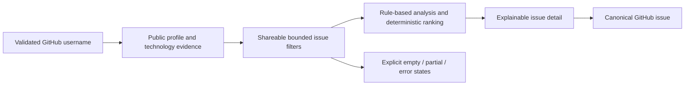

# MVP compliance matrix

This document traces the original IssueScout MVP completion conditions to
production code, executable tests, and operator documentation. It is a
release checklist, not a replacement for the detailed product and engineering
guides.

## User journey



The complete path is exercised against a compiled Go binary and production
Vite build by `completes profile, search, and detail through the built API` in
[`smoke.spec.ts`](../apps/web/e2e/smoke.spec.ts). No live GitHub or database
dependency is involved in that release-blocking journey.

## Original completion conditions

| Original MVP condition                                  | Status                | Implementation evidence                                                                                       | Executable evidence                                                              |
| ------------------------------------------------------- | --------------------- | ------------------------------------------------------------------------------------------------------------- | -------------------------------------------------------------------------------- |
| Enter a GitHub username                                 | Complete              | Home profile form and shared username validator in [`features/profile`](../apps/web/src/features/profile)     | Home-to-profile E2E and invalid-login zero-request E2E                           |
| Retrieve a GitHub profile                               | Complete              | REST adapter, profile usecase, handler, generated contract, and profile page                                  | GitHub client/handler tests and built-stack profile E2E                          |
| Analyze languages from public repositories              | Complete              | Bounded GraphQL snapshot and pure profile analyzer in [`domain/profile`](../apps/api/internal/domain/profile) | Analyzer table tests, benchmark, fixtures, and profile E2E                       |
| Infer major frameworks                                  | Complete              | Manifest aliases and dependency rules for supported ecosystems                                                | Profile analyzer tests and visible framework component tests                     |
| Search open GitHub issues                               | Complete              | Typed GraphQL search with open/public/no-assignee qualifiers, post-filter rules, and partial-match fallback   | Adapter, usecase, handler, HTTPYAC, and built-stack search tests                 |
| Estimate difficulty with rules                          | Complete              | Pure five-level issue analysis in [`domain/issue`](../apps/api/internal/domain/issue)                         | Boundary/interaction table tests and fuzz inputs                                 |
| Display estimated effort                                | Complete              | Rule-based effort bands with evidence and uncertainty                                                         | Domain tests, contract fixture, result/detail UI tests                           |
| Calculate user/issue skill match                        | Complete              | Normalized desired/required technologies and explicit percentage denominator                                  | Recommendation score tests and issue detail fixture                              |
| Display recommendations in score order                  | Complete              | Fixed 100-point model plus deterministic tie-breakers                                                         | Ranking tests, search usecase tests, and ranked-list E2E                         |
| Display an issue detail screen                          | Complete              | Lazy detail route with score, scope, effort, evidence, activity, warnings, and safe body text                 | Detail component tests and mobile detail E2E                                     |
| Navigate to the GitHub issue                            | Complete              | Canonical encoded external link with safe attributes                                                          | Full-journey and safe-detail E2E assertions                                      |
| Present GitHub API errors appropriately                 | Complete              | Stable application errors for not found, rate limit, timeout, and upstream failure                            | Adapter/handler tests plus not-found and rate-limit E2E                          |
| Operate without a database                              | Complete              | Anonymous router composition has no authentication repository dependency                                      | Zero-database router tests, `make dev-smoke`, anonymous E2E                      |
| Backend uses Go and Gin                                 | Complete              | Go module under [`apps/api`](../apps/api) with Gin transport and layered packages                             | Build, lint, race, coverage, fuzz, benchmark, and E2E gates                      |
| Frontend uses React                                     | Complete              | React/TypeScript/Vite application under [`apps/web`](../apps/web)                                             | ESLint, strict TypeScript, Vitest, bundle, and Playwright gates                  |
| Database can be added behind separated responsibilities | Complete and extended | Ports isolate persistence; optional Neon PostgreSQL now implements only authenticated account capabilities    | Architecture policy, repository tests, migration policy, anonymous zero-DB tests |

The detailed behavior behind these rows is defined in
[Product specification and glossary](product.md),
[Profile analysis](profile-analysis.md),
[Issue analysis](issue-analysis.md), and
[Issue recommendations](issue-recommendations.md).

## Non-functional requirements

| Requirement                                                | Enforced result                                                                                                                                                            |
| ---------------------------------------------------------- | -------------------------------------------------------------------------------------------------------------------------------------------------------------------------- |
| Normal API target below three seconds                      | Built API exercises health, profile, repository discovery, issue search, and issue detail with deterministic bounded dependencies; each request must remain below 3,000 ms |
| Profile-analysis target below ten seconds                  | Built profile-analysis request must remain below 10,000 ms                                                                                                                 |
| At most 50 issue candidates                                | Domain constant, configuration bound, GraphQL `first` validation, usecase load test                                                                                        |
| Initially analyze at most 20 detailed candidates           | Configuration bound and production-load usecase test                                                                                                                       |
| At most five concurrent detail operations by default       | Configuration plus measured maximum-active assertion                                                                                                                       |
| GitHub token is server-only                                | Configuration, browser boundary, log tests, release secret scan, and security workflow                                                                                     |
| Input, CORS, and upstream payloads are constrained         | Strict DTO parsing, domain values, exact-origin middleware, adapter normalization                                                                                          |
| Responsibilities remain replaceable                        | Architecture dependency policy rejects transport/domain/adapter inversions                                                                                                 |
| Backend and frontend tests exist at appropriate boundaries | Unit, adapter, handler, contract, component, hook, E2E, race, fuzz, and performance suites                                                                                 |

The latency checks use the compiled production applications with the
deterministic in-process GitHub adapter. They measure IssueScout overhead and
bounded orchestration without internet variance. Live latency additionally
depends on GitHub response time and rate-limit state; see
[Production readiness](production-readiness.md).

## Extensions beyond the original MVP

The original MVP explicitly allowed OAuth and persistence to be deferred.
IssueScout now provides them as optional, isolated capabilities:

- GitHub OAuth Authorization Code + PKCE with minimum `read:user`;
- Neon-compatible TLS PostgreSQL persistence;
- bookmarks and saved searches;
- preferences, privacy export, and confirmed account deletion.

These additions do not change MVP compliance: every public journey remains
anonymous and database-free. AI analysis, notifications, automatic claiming,
and pull-request creation remain outside the delivered boundary. See
[Known limitations and extension seams](limitations.md).

## Release verification

From a clean checkout:

```sh
pnpm install --frozen-lockfile
pnpm run quality:strict
pnpm run e2e
pnpm run release:reproducibility v0.0.0-handover
```

For a fast credential-free product proof:

```sh
make dev-smoke
```

For every API operation and important negative boundary:

```sh
pnpm run http:check
```

No completion row may be changed to partial or deferred without a dedicated
issue, updated product decision, and corresponding contract/test changes.
