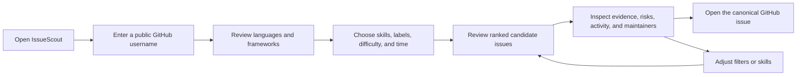

# Product specification and glossary

## Product intent

IssueScout helps a developer answer three questions before investing in an
open-source contribution:

1. Does this issue match technologies I can use?
2. Is the work described clearly enough to estimate?
3. Does the repository appear healthy and responsive enough for a contribution?

It analyzes public GitHub evidence and returns explainable recommendations. It
does not promise that an issue is unclaimed, guarantee maintainer acceptance,
or turn estimates into schedules.

## Product boundaries

The core journey is anonymous and stateless. The browser calls IssueScout, the
API calls GitHub, and bounded public snapshots may be cached only in process
memory. Anonymous handlers do not access or write a database. A GitHub token
used for upstream capacity remains server-side.

Optional GitHub OAuth, a private issue contribution task board, bookmarks,
saved searches, preferences, export, and account deletion are separate authenticated capabilities. Their
Neon-compatible PostgreSQL adapter remains behind authentication and
persistence ports so account behavior cannot become a hidden dependency of
public analysis.

Authenticated users analyzing their own GitHub login also receive a
private-by-default contribution portfolio preview assembled from bounded public
merged-PR facts. It is evidence presentation, not employment verification or
automatic publication.

IssueScout deliberately does not:

- submit, assign, claim, edit, or comment on GitHub issues;
- clone arbitrary repositories or execute repository code;
- store anonymous browsing or analysis history;
- expose raw GitHub transport responses or credentials;
- infer certainty when a bounded sample is incomplete.

## Primary users

| User                       | Need                                                          | Successful outcome                                 |
| -------------------------- | ------------------------------------------------------------- | -------------------------------------------------- |
| New contributor            | Find approachable work without reading dozens of repositories | A small ranked list with effort and evidence       |
| Experienced contributor    | Filter by technology, time, and repository health             | A shareable search and detailed risk view          |
| Maintainer-aware evaluator | Understand response and merge behavior                        | Bounded metrics with sample size and confidence    |
| IssueScout engineer        | Change rules or adapters safely                               | An executable contract and deterministic test path |

## User journeys

### Profile journey

The user supplies a validated GitHub user or organization login. IssueScout
normalizes bounded public repository and contribution evidence, then reports
technology percentages, recent technologies, OSS activity, sampled
star/fork/contribution views, explainable five-level diagnostics, and
an evidence-linked chronological OSS Journey and a weekly contribution streak.
A missing owner, exhausted
GitHub rate limit, timeout,
and upstream failure are different recoverable states. See
[Public profile and OSS analysis](profile-analysis.md).

Repository detail also includes four independently explainable OSS health
indicators. Security remains a labeled third-party heuristic and never implies
safety. See [OSS health dashboard methodology](repository-health.md).

### Discovery journey

The user selects bounded filters. The API performs one candidate search, applies
eligibility rules, enriches only a bounded leader set, ranks deterministically,
and paginates after analysis. The URL owns shareable search state.

### Recommendation journey

The detail view explains the issue category, scope, difficulty, estimated
effort, skill match, repository readiness, bounded activity, maintainer
responsiveness, and conservative warnings. Unknown evidence is visibly unknown,
not silently converted to zero.

## Domain glossary

| Term                       | Meaning                                                                                    |
| -------------------------- | ------------------------------------------------------------------------------------------ |
| Candidate                  | A normalized open GitHub issue returned by bounded discovery before full scoring           |
| Eligibility                | Cheap rules that decide whether a candidate can enter the analysis window                  |
| Enrichment                 | Bounded repository, issue, activity, and maintainer evidence added to a candidate          |
| Ranked issue               | A candidate plus analysis, score components, and stable tie-break fields                   |
| Evidence                   | Typed, bounded facts supporting an analysis result; never arbitrary secret-bearing text    |
| Confidence                 | `high`, `medium`, or `low` strength assigned to an inference or sample                     |
| Unknown                    | Evidence was not available or sufficient; it is not equivalent to `absent`                 |
| Warning                    | A stable conservative risk code with fixed safe text                                       |
| Snapshot                   | Normalized public upstream data stored only in a bounded in-memory cache                   |
| Evidence status            | `exact`, `sampled`, or `unavailable`; unavailable never means measured zero                |
| Proficiency diagnostic     | Five-level rule output backed by public repository evidence, not a certification           |
| Repository readiness       | Explainable contribution-support band derived from bounded public evidence                 |
| Repository discovery cache | Five-minute canonical repository window, independent of pagination                         |
| Candidate cache            | Five-minute canonical search window cache, independent of pagination and effort            |
| Detail cache               | Five-minute canonical issue/repository snapshot cache                                      |
| Anonymous core             | Public profile, search, and recommendation behavior that never requires OAuth or DB access |
| Authenticated workspace    | Opt-in account behavior for saved data, isolated from the anonymous core                   |

## Success and safety measures

Product usefulness is measured by understandable results and successful
journeys, not by increasing data collection. Engineering measures include
bounded upstream calls, deterministic rankings, contract coverage, accessibility,
request correlation, strict CI/security checks, and reproducible release
archives. See [Testing](testing.md), [CI](ci.md), and
[Security](security.md).
