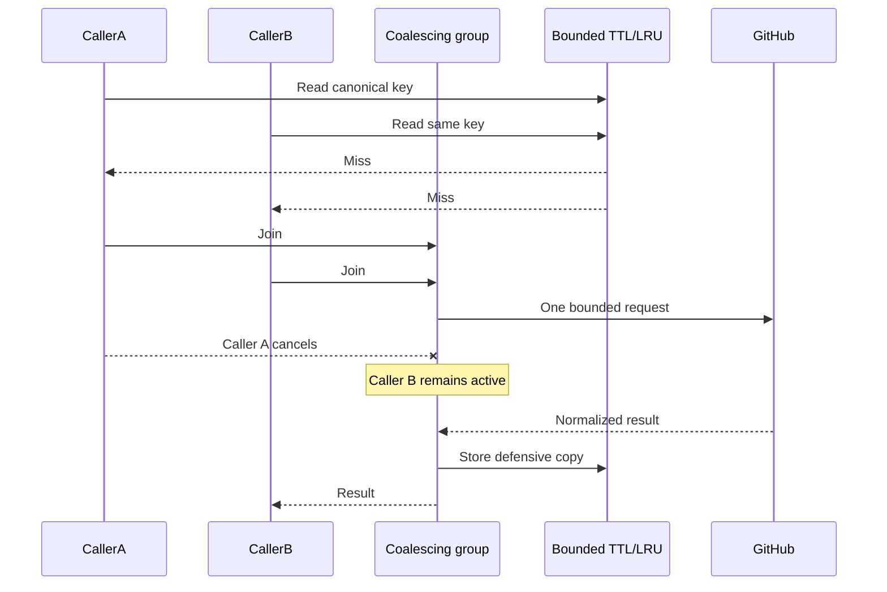

# Production readiness review

This is the final engineering review for the MVP. It records the conditions
under which the performance targets apply, the bounded-resource evidence,
privacy-safe diagnostics, frontend audit, and remaining operational risks.

## Readiness verdict

The anonymous MVP is production-shaped and releaseable as native host
artifacts. Optional authentication and account persistence are implemented but
must be enabled only after provider, OAuth App, PostgreSQL, and protected
environment configuration have been reviewed.

Readiness means:

- all public capabilities run without OAuth or PostgreSQL;
- external work, memory, request bodies, responses, and concurrency are bounded;
- cancellation reaches active GitHub work;
- every API operation has OpenAPI and HTTPYAC coverage;
- logs diagnose latency/cache/upstream outcomes without user identifiers;
- production bundles and native artifacts pass reproducibility and secret scans;
- deployment promotion remains provider-neutral until a hosting adapter exists.

## Resource-bound audit

| Surface                     |                          Bound | Enforcement and evidence                                     |
| --------------------------- | -----------------------------: | ------------------------------------------------------------ |
| Profile repository evidence |           20 per source window | Configuration validation and GraphQL variables               |
| Manifest inspection         |               3 per repository | Configuration and adapter alias selection                    |
| Issue search candidates     |                             50 | Domain constant, configuration, GraphQL validation           |
| Issue detailed analysis     |                             20 | Configuration and `TestSearchIssuesProductionLoadBounds`     |
| Detail concurrency          |       5 by default, maximum 20 | `errgroup.SetLimit`, configuration, maximum-active assertion |
| Repository candidates       |                             50 | Search adapter and configuration                             |
| Repository enrichments      |      10 by default, maximum 20 | One batched GraphQL request                                  |
| GitHub response body        |                          2 MiB | Limited reader and oversized-response failure                |
| Manifest response body      |                        512 KiB | Separate limited reader                                      |
| JSON request body           | Handler-specific fixed maximum | `http.MaxBytesReader` through shared strict parser           |
| Cache entries               |     500 or 1,000 by capability | Mutex-protected TTL/LRU with concurrent churn test           |
| Retry attempts              |                        3 total | Only transport failure and 502/503/504                       |
| Account page size           |                     50 maximum | Domain pagination values and repository query limits         |
| Account data quotas         |              Fixed per account | Transactional quota checks and serialized writes             |

Equivalent cache misses are coalesced. Each caller can cancel independently;
the shared operation continues while another active caller needs it and is
cancelled when the last waiter leaves. Cache values are defensively cloned so
request-owned slices and maps cannot mutate shared state.

## Latency targets and conditions

The original targets are:

- normal APIs: less than 3 seconds;
- profile analysis: less than 10 seconds.

`meets API latency targets with deterministic bounded dependencies` in
[`smoke.spec.ts`](../apps/web/e2e/smoke.spec.ts) exercises the compiled API,
real router/middleware/usecases, deterministic GitHub adapter, and production
configuration. Health, public profile, repository discovery, issue search, and
issue detail each fail at 3,000 ms; profile analysis fails at 10,000 ms.

`TestSearchIssuesProductionLoadBounds` separately injects 50 eligible
candidates and twenty 20 ms detail dependencies. It proves exactly 20 detail
leaders, no more than five active operations, and completion below one second
with broad race-enabled CI headroom. Cancellation must unwind the same fan-out
below one second. Pure domain work has fixed nanosecond/allocation budgets in
`config/quality-budgets.json`.

These targets apply when:

1. the IssueScout process is healthy and not CPU/memory throttled;
2. network, DNS, TLS, and GitHub respond within the remaining budget;
3. GitHub is not rate limited;
4. configured bounds remain at or below documented maxima;
5. no external deployment queue or cold start consumes the budget.

The API's defensive request timeouts are intentionally larger than the target
to permit a safe classified failure: GitHub client 10 seconds and long
analysis route deadlines up to 15 seconds. A timeout ceiling is not an SLO.
Production service-level measurement should emit low-cardinality histograms by
route template and status outside the application; it must not label metrics
with usernames, repositories, issue numbers, or request IDs.

## Upstream, cache, and cancellation behavior

Retries never apply to validation, authentication, not-found, permission, or
rate-limit results. Response bodies are drained/closed between retryable
attempts. Partial GraphQL data and bounded enrichment failure become explicit
warnings when a useful safe result remains possible.

## Observability and privacy audit

Request completion events contain only:

- request ID;
- HTTP method;
- normalized route template;
- status;
- latency in milliseconds;
- nonnegative response bytes;
- `HIT` or `MISS` when a cache-aware handler emitted it;
- stable application error code when present.

GitHub completion events contain only `upstreamService=github`, a fixed
operation name, fixed outcome, attempts, latency, optional request ID, and
status. Tests assert that login values, repository/issue path values, tokens,
upstream URLs, authorization, user agent, client address, query strings, and
raw bodies are absent. See [Observability](observability.md) for operational
use.

## Frontend performance audit

| Concern               | Result                                                                                                            |
| --------------------- | ----------------------------------------------------------------------------------------------------------------- |
| Request waterfall     | Profile user and analysis queries start concurrently; unresolved-request test fails if either waits for the other |
| Duplicate requests    | Canonical lowercase query keys reuse fresh profile data across case-only rerenders                                |
| Cancellation          | TanStack Query signals abort obsolete profile, search, and detail work                                            |
| Rerenders             | Derived profile tags use memoized transformations; server state stays in query cache                              |
| Route loading         | Home, profile, repository, search, detail, not-found, and account routes are lazy chunks                          |
| Initial shared bundle | Single-asset gzip ceiling is 75 KiB                                                                               |
| Aggregate assets      | JavaScript plus CSS gzip ceiling is 207 KiB                                                                       |
| Mobile/zoom           | Playwright checks 390 px mobile and 320 CSS px equivalent without horizontal overflow                             |

The latest build must pass `pnpm run bundle:check`; asset names and exact sizes
are build outputs rather than permanent documentation.

## Security and delivery audit

- OpenAPI, generated types, router methods/paths, fixtures, embedded contract,
  and HTTPYAC requests cannot drift independently.
- CodeQL, dependency review, Trivy, zizmor, actionlint, shellcheck,
  golangci-lint, ESLint, secret-surface scans, and migration policy fail closed.
- Pull-request jobs are read-only, receive no application secret, and use
  immutable action SHAs.
- Six native OS/architecture archives are built twice, byte-compared, scanned,
  checksummed, given an SPDX SBOM, and smoke-tested without Docker.
- Publishing and promotion require protected environments; provider deployment
  is intentionally not simulated.

## Final self-review

| Review lens   | Result                                                                                                           |
| ------------- | ---------------------------------------------------------------------------------------------------------------- |
| Architecture  | Transport, application, domain, ports, and adapters obey checked dependency direction                            |
| Correctness   | Original MVP rows are traced in [MVP compliance](mvp-compliance.md)                                              |
| Performance   | Bounds, deterministic latency targets, benchmarks, caches, and bundles are executable gates                      |
| Security      | Anonymous isolation, credential handling, OAuth/CSRF, data ownership, workflow and release boundaries are tested |
| Test quality  | Narrow tests plus contract, HTTPYAC, E2E, race, fuzz, benchmark, and clean artifact journeys                     |
| Accessibility | Keyboard focus, dialogs, labels, reduced motion, mobile/zoom, and visible state distinctions are covered         |
| Operations    | Health split, request correlation, release rollback, limitations, and incident paths are documented              |
| Documentation | Links, commands, variables, API paths/errors, Mermaid syntax, GoDoc, Swagger, and HTTPYAC are checked            |

Open risks are not hidden by this verdict. They are listed in
[Known limitations and extension seams](limitations.md), and the operating
response is in [Operations runbook](operations.md).
