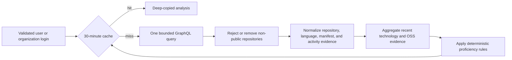

# Public profile and OSS analysis

IssueScout builds an explainable technical profile from bounded public GitHub
evidence. It does not claim to measure all experience, infer private work, or
certify proficiency. The versioned
[OpenAPI contract](../packages/contracts/openapi.yaml) defines the response;
this guide defines how the evidence is selected and interpreted.

## One-request evidence pipeline



For an individual user, the query requests:

- at most 20 active public owned repositories;
- at most 20 active public forks;
- at most 20 public contributed repositories ordered by recent repository
  activity;
- at most 20 visible starred repositories;
- at most 10 language edges per owned repository;
- eight conventional manifest locations in the same GraphQL request, of which
  at most three language-relevant paths are analyzed per repository;
- exact public authored issue and pull-request search counts for the 365-day
  window;
- commit and pull-request-review counts across at most 20 public contribution
  repository groups;
- one official GitHub contribution calendar containing at most 54 ordered
  weeks and seven public daily cells per week;
- at most 20 recent public merged pull requests for a reproducible private
  portfolio preview.

An organization receives the owned and forked repository analysis.
Individual-only star and contribution segments are `unavailable`, with a typed
warning. The API does not misclassify an organization as a missing user.

The query does not paginate beyond these caps. One analysis cache miss makes
one GitHub request; concurrent equivalent misses are coalesced. The inbound
context controls the request, so cancellation and the profile timeout stop the
work when no active caller still needs it. Successful responses expose
`X-IssueScout-Cache: MISS` for a fresh bounded snapshot and
`X-IssueScout-Cache: HIT` for a defensive cache copy.

## Public-only and anonymous invariant

Owned, forked, and contributed connections include an upstream `PUBLIC`
filter. Receiving a non-public node from one of those required connections is
an upstream contract failure. Star and contribution connections can be
privacy-ambiguous for the API viewer, so the adapter inspects repository
visibility and discards every non-public node before constructing a domain
snapshot.

IssueScout never requests or returns restricted-contribution totals. Starred
repository totals are returned as `null` because the upstream aggregate may
include information the response must not characterize. Starred evidence
describes interest and never increases a proficiency score.

The anonymous route does not open a database connection, transaction, query,
or write. Usernames, upstream payloads, and derived analyses are not persisted.
Only a bounded, process-local, deep-copied LRU entry is retained for 30 minutes.

## Public contribution calendar

The adapter normalizes GitHub's official `contributionCalendar` into ordered
week columns. Each day contains an ISO date, Sunday-zero weekday row, public
contribution count, and one of five intensity levels. It rejects malformed
dates, negative counts, invalid levels, duplicate or out-of-order dates, cells
outside the analysis window, more than 54 weeks, or a total that differs from
the sum of daily cells. This preserves leap days and year boundaries without
letting React recalculate counts, levels, or cell order.

The profile page renders the complete grid in a horizontally scrollable table,
with month and weekday labels, a Less/More legend, and focusable day
descriptions. An unavailable calendar is non-fatal: repository, technology,
and contribution metrics still render with a
`contribution_calendar_unavailable` warning. Organization profiles always use
that unavailable state. No calendar data is persisted and no broader OAuth
scope is requested.

## Exact, sampled, and unavailable

Every count or collection has an evidence status:

| Status        | Meaning                                                                 |
| ------------- | ----------------------------------------------------------------------- |
| `exact`       | Complete public count for the documented connection, filter, and window |
| `sampled`     | Observed value inside a documented cap; never present it as a total     |
| `unavailable` | GitHub did not provide the segment; the numeric placeholder is not zero |

Owned, forked, and contributed totals are exact public totals, but their
returned repository items become sampled when the total exceeds 20. Starred
items are always sampled. Commit and review activity is sampled across at most
20 public repositories. Public authored issue and pull-request search counts
are exact for the 365-day window. Repositories touched are a deduplicated
sample across the four capped public contribution-group collections.

Archived contributed repositories remain historical evidence but are not
counted as active or recently used technology.

## Technology evidence

Owned repository language bytes produce the primary language percentages using
the largest-remainder method. Percentages always sum to 100. The response keeps
the nine leading languages and combines the remainder as `Other` when more
than ten languages are observed. `languageStatus` is `sampled` when the owned
repository collection is capped or when a repository's ten GraphQL language
edges do not cover its reported total bytes; otherwise it is `exact`.

Framework evidence comes only from supported conventional manifests in active
owned repositories. Recent technology uses the newest push/update timestamp
inside the 365-day window across owned, contributed, and forked repositories.
A repository is counted at most once per technology and source.

The five-level diagnostic score is deterministic:

```text
min(35, round(language percentage × 0.35))
+ min(20, owned repository count × 5)
+ min(20, contributed repository count × 5)
+ min(15, recent repository count × 3)
+ min(10, framework manifest count × 5)
+ min(5, forked repository count)
```

The result is capped at 100 and mapped as follows:

|  Score | Level | Label          |
| -----: | ----: | -------------- |
|   0–19 |     1 | `exploring`    |
|  20–39 |     2 | `developing`   |
|  40–59 |     3 | `intermediate` |
|  60–79 |     4 | `advanced`     |
| 80–100 |     5 | `expert`       |

The label is an evidence diagnostic, not a credential. Confidence is `high`
for at least five repository observations with complete relevant collections,
`medium` for at least two observations, `low` for one, and `unavailable` for
none. A collection cap lowers otherwise high confidence.

## OSS experience

OSS experience summarizes public evidence with another deterministic score:

```text
min(40, public authored pull requests × 4)
+ min(30, public contributed repositories × 5)
+ min(20, sampled public pull-request reviews × 2)
+ min(10, public authored issues)
```

|  Score | Level                |
| -----: | -------------------- |
|      0 | `no_public_evidence` |
|   1–14 | `emerging`           |
|  15–39 | `contributing`       |
|  40–69 | `active`             |
| 70–100 | `sustained`          |

Confidence is high when the authored pull-request input is exact, public
repository evidence is available, and the score is at least 40. Positive lower
or sampled evidence is medium. No public evidence is low confidence. Missing
both primary inputs makes the level and confidence `unavailable`.

## Contribution portfolio evidence

The merged pull-request search is bounded to 20 public results in the same
365-day window. The adapter accepts only canonical `github.com` pull-request
URLs, public repository visibility, positive PR numbers, bounded titles, and a
real merge timestamp. Duplicate canonical references are removed. The server
derives displayed counts, distinct repositories, and language groups from the
same displayed dataset; `totalMerged` remains an exact search count while a
truncated item list is labeled `sampled`.

Automatic summaries only restate the observed repository, merged status, and
PR title. They do not infer impact, performance, quality, or employer
endorsement. React renders upstream text as text and links only to the validated
canonical URL. The portfolio card appears as a private preview only when the
authenticated GitHub login matches the analyzed profile, and it says explicitly
that nothing is published automatically. Anonymous profile analysis remains
database-free and does not persist the portfolio snapshot.

## OSS Journey timeline

The journey is derived from the same validated public merged-PR evidence. It
normalizes merge, first-observed repository, and first-observed primary-language
milestones, then orders them by UTC timestamp and a stable ID tie-breaker. Every
milestone links to the canonical pull request that supports it.

`First observed` is deliberately scoped to the bounded sample; it is not a
lifetime claim. When the merged-PR collection is truncated, the complete
timeline is labeled `sampled`. Issue-comment and review milestones are not
invented when dated canonical evidence is unavailable.

## Contribution streak

The streak groups each validated merged PR into a UTC week beginning Monday at
00:00. A week qualifies when it contains at least one distinct canonical PR
URL. `currentWeeks` is zero unless the current UTC week qualifies;
`longestWeeks` is the longest uninterrupted sequence in the observed sample.
Each qualifying week returns all evidence URLs used for its count.

Streak status inherits the portfolio evidence status, so a truncated GitHub
search produces a sampled streak rather than a lifetime claim. The calculation
does not use commits or inferred events that lack dated canonical evidence.

## OSS Quest

The public profile evaluates a versioned five-item catalog: first issue
comment, first PR, first review, first merged PR, and merged contributions to
three repositories. Each item is `locked`, `in_progress`, `completed`, or
`unavailable`; unsupported issue-comment evidence remains unavailable instead
of being guessed. The first eligible unfinished item supplies one next action.

Quest state is derived on read from the same public evidence and does not send
notifications, reminders, or celebratory messages. Catalog version
`2026-08-01` makes future rule changes explicit and testable.

## Failure and partial-data behavior

A missing repository owner, rate limit, cancellation, timeout, and unusable
required payload remain distinct typed errors. Optional GraphQL failures return
the usable public segments plus stable warnings such as:

- `owned_repositories_unavailable`;
- `contribution_activity_unavailable`;
- `contribution_calendar_unavailable`;
- `contribution_portfolio_unavailable`;
- `authored_pull_requests_unavailable`;
- `organization_activity_unavailable`;
- `private_starred_repositories_excluded`;
- `github_partial_response`.

Warnings contain fixed safe text. They do not include GraphQL error messages,
repository contents, tokens, private counts, or response bodies.

## Verification

Domain table tests cover exact, sampled, unavailable, archived, empty, and
five-level threshold behavior. Adapter fixtures cover query bounds, public
filters, private-node exclusion, partial GraphQL data, organizations, missing
users, invalid payloads, and pre-I/O validation. Usecase tests cover
singleflight, cancellation, caching, and typed error mapping.

`BenchmarkAnalyzeProfileSnapshotBounded` analyzes the maximum repository and
language fixture. CI enforces 2 ms, 512 KiB, and 5,000 allocations per
operation with runner headroom. Run the full checks with:

```bash
pnpm run coverage:api
pnpm run performance:api
pnpm run contracts:check
```
