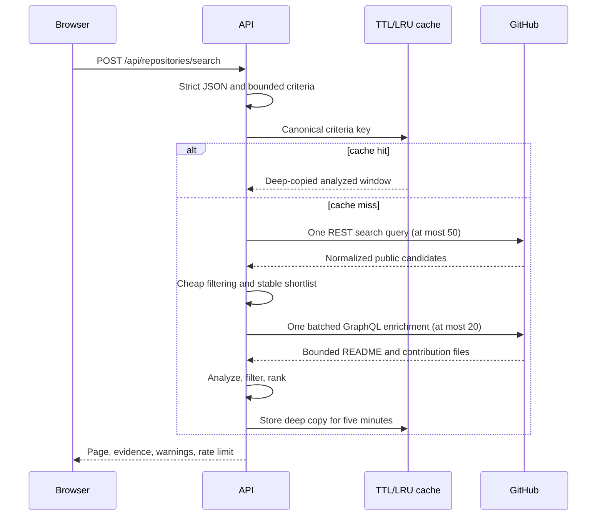

# Repository discovery

Repository discovery finds public open-source repositories without cloning or
executing their code. It uses one bounded GitHub REST search, one bounded
GraphQL enrichment, explicit evidence states, deterministic rules, and an
in-memory cache. The anonymous route never reads or writes a database.

## Bounded request flow

A cache miss makes at most two upstream requests. The first query obtains at
most 50 candidates. The second query enriches 10 repositories by default and
at most 20 when explicitly configured, in one batch; it is not a
per-repository fan-out. Pagination is applied after analysis and is excluded
from the canonical cache key.

## Frontend journey

The lazy-loaded `/repositories` route is available from the primary navigation
without signing in. A visitor can also begin on `/profiles/:username`: the
profile dashboard creates a repository-discovery link from the analyzed
language and technology evidence, but leaves the form unsubmitted so the
visitor can review every condition first.

One typed filter module owns form defaults, validation, request mapping, and
the URL codec. A URL contains only canonical filter values plus `search=1`
after submission; it never contains a result payload, upstream response, or
profile data. Back, forward, refresh, copied links, and pagination therefore
restore the exact validated conditions while the server remains the authority
for scoring and ordering.

Repository cards distinguish facts from estimates. They show activity,
popularity, license, topics, technologies, contribution documents, starter
issues, readiness reasons, preliminary difficulty reasons, and Japanese README
evidence. Confidence, sampled content, and unavailable evidence are labeled
explicitly. The interface does not turn unavailable values into zero or
recompute any server decision.

Each card also exposes up to three recent open `good first issue` or
`help wanted` issues from the same batched enrichment, compares repository
technology evidence with the user's selected language and technology filters,
and shows a separate first-contribution friendliness score.

Recoverable states are separate:

- a first load uses a skeleton and keeps the form operable;
- a later page request keeps the previous result while the replacement loads;
- empty and out-of-range pages preserve the submitted filters;
- partial enrichment keeps usable repositories and explains its warnings;
- invalid shared links reset to safe defaults without calling the API;
- rate limits and upstream failures provide a retry path.

Obsolete requests are cancelled through the query client. Keyboard, mobile
navigation, tooltip focus, reduced motion, and 320 CSS pixel reflow (equivalent
to a 640-pixel viewport at 200% browser zoom) are covered by automated tests.

## Filters and defaults

The endpoint stays broadly reusable, while the browser starts with a
conservative contribution-oriented shortlist:

| Input              | API default | Browser initial value | Bound or accepted values            |
| ------------------ | ----------- | --------------------- | ----------------------------------- |
| Languages          | empty       | empty                 | Up to 10 safe values                |
| Technologies       | empty       | empty                 | Up to 10 safe values                |
| SPDX licenses      | empty       | empty                 | Supported SPDX allowlist            |
| OSS categories     | empty       | empty                 | Nine documented categories          |
| Minimum stars      | 10          | 10                    | 0–10,000,000                        |
| Minimum forks      | 0           | 0                     | 0–10,000,000                        |
| Open issues        | 0–unbounded | 1–500                 | Each explicit bound is 0–10,000,000 |
| Updated within     | 365 days    | 365 days              | 1–3,650 days                        |
| Maximum difficulty | unset       | 3                     | 1–5                                 |
| Minimum readiness  | 0           | 40                    | Inclusive score from 0–100          |
| Japanese README    | unset       | any evidence state    | `true` or `false`                   |
| Fork policy        | `exclude`   | `exclude`             | `exclude`, `include`, `only`        |
| Exclude archived   | `true`      | `true`                | `true` or `false`                   |
| Page / page size   | 1 / 20      | 1 / 20                | Page 1–50; page size 1–50           |

The supported OSS categories are `application`, `data`, `documentation`,
`education`, `framework`, `infrastructure`, `library`, `security`, and
`tooling`. Filter values reject control characters, quotes, backslashes,
excessive length, and excessive collections before GitHub I/O. SPDX
identifiers and categories use allowlists.

## Classification and evidence

Category classification follows one deterministic priority: security, data,
infrastructure, documentation, education, framework, library, tooling, then
application. Topics and bounded README text are matched as complete normalized
technology terms rather than arbitrary substrings.

Japanese README evidence reports:

- `detected` after at least 20 Japanese-script runes and a 5% share of letters;
- `high` confidence after 100 runes, a 20% share, and unsampled content;
- `medium` confidence for the remaining positive matches and clear negative
  matches;
- `unavailable` when GitHub did not expose README content.

README analysis is capped at 64 KiB. The API reports the inspected byte count
and whether the content was sampled.

Difficulty is an explainable 1–5 preliminary contribution estimate based on
repository size and contribution support signals. Readiness starts from a
fixed point budget and records every positive or negative reason. It maps to
`needs_work`, `promising`, or `ready`; it is not a guarantee that maintainers
will accept a contribution.

First-contribution friendliness is a separate 100-point model. A CONTRIBUTING
guide, open good-first issue, issue template, and explicit README test command
contribute 15 points each. A maintainer response in the bounded ten-issue
sample and a merged pull request from an external contributor in the bounded
twenty-PR sample contribute 20 points each. Every signal carries an evidence
status; unavailable enrichment earns no points and remains unavailable rather
than observed absence. Starter issue selection prefers `good first issue`,
then fills the three-item limit from `help wanted`, de-duplicated by number.

## Partial data and privacy

If the required search fails, the route returns a mapped request error. If the
optional enrichment batch fails, eligible repositories remain useful and
README-derived evidence becomes `unavailable` with a typed warning.
Cancellation and deadlines still stop the complete operation.

Only public normalized evidence enters responses or the bounded in-memory
cache. Tokens, raw upstream payloads, README text, and anonymous search history
are never returned or persisted.

Executable examples, including invalid requests, are in
[`http/repository-discovery.http`](../http/repository-discovery.http).
